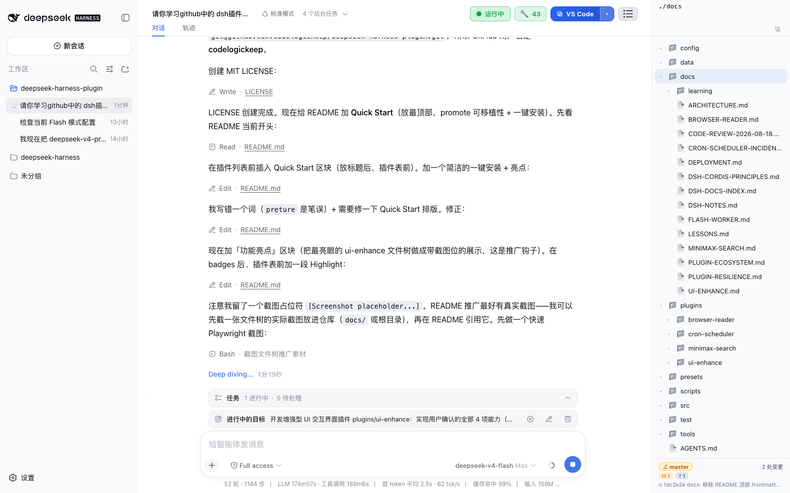

# deepseek-harness-plugin

**DSH（DeepSeek Harness）插件集合仓库 + 安装脚手架**：把你有用的 DSH 插件统一沉淀在这里，并提供开发/安装插件的脚手架。

🚀 **快速开始**（一键装齐全部插件）：

```bash
# 1) 先跑一次 `npx @deepseek-ai/dsh web`，让 DSH 生成 cordis.patch.yml 骨架
# 2) 克隆本仓库
git clone git@github.com:codelogickeep/deepseek-harness-plugin.git
cd deepseek-harness-plugin
npm install                       # 根依赖
cd plugins/ui-enhance && pnpm install && cd ../..  # ui-enhance 构建依赖
npm run install:plugins           # 一键：构建+自检+装进 profile+自动补 patch 引用
# 3) 重启 DSH —— 全部插件生效
```

 

**✨ 亮点：增强型 UI（ui-enhance）—— 右侧实时文件树**

左侧侧边栏同款浅色风格的文件树，拖拽调宽、双击文件在 IDE 中打开、路径一键复制，**git 状态实时刷新**（fs.watch + SSE，提交/改文件即时更新）：
- 📁 递归目录 + git 状态徽标（M/A/D/U ←）· 🐘 可拖拽调宽 220-520px
- 🖱 双击文件 → 在当前 IDE（VS Code/Cursor/Windsurf/Trae）打开
- 📋 头部路径显示 + 一键复制（`./` 开头）
- ⚡ **实时刷新**：改文件/提交后文件树即时更新，无需手动刷新



---

**当前已收录插件：**

| 插件 | 说明 | 形态 |
| --- | --- | --- |
| **钉钉桥接器** (dsh-dingtalk-bridge) | 在钉钉里直接和 DSH Agent 对话，含会话管理控制台、**主动推送**（定时提醒→钉钉） | 独立进程 ↔ DSH `/api` |
| **MiniMax 网页搜索** (minimax-search) | 把 MiniMax 搜索注册为 DSH 宿主 Web 搜索 provider，`web_search` 工具直接可用 | DSH 宿主插件 (`cordis.patch.yml`) |
| **自研定时调度** (cron-scheduler) | 标准 **5 字段 cron 表达式**定时任务（`0 10 * * *`），配置文件驱动、跨重启防重复，到点唤醒指定 Agent 会话 | DSH 宿主插件 (`cordis.patch.yml`) |
| **浏览器阅读** (browser-reader) | Playwright 驱动真实 Chromium/Edge，`web_read` 系列工具确定性读 JS 渲染页面（含 console/截图/继续读/关闭） | DSH 宿主插件 (`cordis.patch.yml` + profile 依赖 playwright-core) |
| **增强型 UI 交互界面** (ui-enhance) | 浏览器端 UI 增强插件：会话头部实时状态面板 + 右上角打开 IDE（VS Code/Cursor/Windsurf/Trae 动态检测） | client bundle 插件（`dsh.client.platform=web`） |
| **flash-worker**（pro 指挥、flash 执行） | 给主 agent 加 `flash_agent` 工具，把具体编码任务委派给 flash 模型子 agent，形成 orchestrator-worker 两级协同 | Agent preset（脚手架渲染安装） |

> 另启用 DSH **官方** `dsh-schedule`（`schedule_create`/`list`/`delete`，after/at/every）
> 作为补充：临时/会话内定时用官方，固定 cron 节奏用自研 cron-scheduler。区别见 [插件 3](#插件-3自研定时调度-cron-scheduler)。

> 以后开发的新插件都放这里（详情见 [插件生态导览](docs/PLUGIN-ECOSYSTEM.md)）。

---

## 插件目录

| # | 插件 | 快速入口 |
| --- | --- | --- |
| 1 | 钉钉桥接器 | [docs/DEPLOYMENT.md](docs/DEPLOYMENT.md) 部署 · [docs/ARCHITECTURE.md](docs/ARCHITECTURE.md) 架构 |
| 2 | MiniMax 搜索 | [docs/MINIMAX-SEARCH.md](docs/MINIMAX-SEARCH.md) 一键接入 |
| 3 | 自研定时调度 | [插件 3](#插件-3自研定时调度-cron-scheduler) · 事故复盘 [docs/CRON-SCHEDULER-INCIDENT.md](docs/CRON-SCHEDULER-INCIDENT.md) |
| 4 | flash-worker（pro 指挥、flash 执行） | [docs/FLASH-WORKER.md](docs/FLASH-WORKER.md) 原理/安装/使用 |
| 5 | 浏览器阅读 (browser-reader) | [插件 5](#插件-5浏览器阅读-browser-reader) · 文档 [docs/BROWSER-READER.md](docs/BROWSER-READER.md) |
| 6 | 增强型 UI 交互界面 (ui-enhance) | [插件 6](#插件-6增强型-ui-交互界面-ui-enhance) · 文档 [docs/UI-ENHANCE.md](docs/UI-ENHANCE.md) |
| — | 脚手架/方法论 | [docs/PLUGIN-ECOSYSTEM.md](docs/PLUGIN-ECOSYSTEM.md) · [docs/DSH-NOTES.md](docs/DSH-NOTES.md) |
| — | 插件容错研究 | [docs/PLUGIN-RESILIENCE.md](docs/PLUGIN-RESILIENCE.md)（为什么第三方插件能搞崩 DSH + 自检防线）|

---

## 插件 1：钉钉 ↔ DSH 桥接器

让你**在钉钉里直接和 DSH 中的 Agent 对话**。采用钉钉**企业内部应用 + Stream 模式**，无需公网域名/固定 IP/反向代理，本地即可运行。

### 快速开始

```bash
# 1. 安装依赖
npm install

# 2. 填写配置（复制模板，填入钉钉应用凭证）
cp .env.example .env

# 3. 校验配置
npm run check:config

# 4. 启动
npm start
```

> 前提：
> - Node.js ≥ 22
> - DSH Web 正在运行（默认 `http://127.0.0.1:3080`）
> - 已按 [docs/DEPLOYMENT.md](docs/DEPLOYMENT.md) 在钉钉开放平台创建企业内部应用并启用机器人

### 架构

```
┌──────────┐   Stream WS    ┌──────────────────┐   HTTP POST /api/session.*   ┌──────────────┐
│  钉钉客户端  │ ───────────► │  dsh-dingtalk-   │ ──────────────────────────► │   DSH Host    │
│ (企业内部App│               │  bridge (daemon) │                               │  (Agent 会话)  │
│   机器人)   │ ◄─────────── │                  │ ◄────────────────────────── │              │
└──────────┘   消息应答Webhook└──────────────────┘   WS /api/events.mux        └──────────────┘
```

- **钉钉侧**：官方 `dingtalk-stream` SDK 连接钉钉 Stream 网关，订阅 `TOPIC_ROBOT` 接收机器人消息；用消息携带的 `sessionWebhook` 回发回复。
- **DSH 侧**：复用浏览器同款 `/api` 协议 —— `POST /api/session.prompt` 发消息，`WS /api/events.mux` 收 Agent 回复事件流。
- **映射**：每个钉钉会话（单聊/群聊）稳定映射到一个 DSH 会话，上下文连续，重启不丢。

详见 [docs/ARCHITECTURE.md](docs/ARCHITECTURE.md)。

### 钉钉内指令（会话管理控制台）

| 指令 | 说明 |
| --- | --- |
| `/status` | 查看当前投递目标（会话、项目、标题、状态） |
| `/list` | 按 DSH 工作区分组列出会话（▶=当前目标；`/list all` 平铺含未挂载） |
| `/use <序号\|关键词\|会话ID>` | 切换投递目标到某个会话（**历史保留，切回可续聊**） |
| `/new [路径]` | 新建一个 DSH 会话并设为当前目标（可选指定项目路径） |
| `/help` | 显示帮助 |

- 每个钉钉会话（单聊/群聊）对应一个「投递目标」DSH 会话，映射持久化到 `data/session-mapping.json`（**不入库**）。
- `/use` 切换后原会话保留，切回可续聊；新会话默认独立上下文。

### 主动推送（定时提醒 → 钉钉）

DSH 会话产生**非用户触发的消息**（自研 `cron-scheduler` 或官方 `dsh-schedule` 定时提醒到期、Agent 主动输出）时，
桥接器会把它推到将该会话设为投递目标的钉钉会话（`📨 Agent 主动消息` 前缀）。

- 前提：该钉钉用户**先给机器人发过消息**（持久化其 `sessionWebhook`）。
- **只推最终结果**：中间输出（思考/工具过程）不推，静默 `ACTIVE_PUSH_QUIET_MS`（默认 2.5s）后仅推最终结论。
- 配置：`ENABLE_ACTIVE_PUSH=true`（默认开）· `ACTIVE_PUSH_PREFIX=📨 Agent 主动消息` · `ACTIVE_PUSH_QUIET_MS=2500`。
- 链路：`定时到期 → Agent 输出 → 事件流捕获 → 去抖只取最终 → 持久 webhook → 钉钉`。
- 端到端已实测：`docs/LESSONS.md`「番外：定时任务 + 主动推送」。

---

## 插件 2：MiniMax 网页搜索（DSH 宿主插件）

把 [MiniMax「coding_plan/search」](https://platform.minimaxi.com) 注册为 DSH 的 `web` 搜索 provider，替代失效的 DeepSeek 官方搜索。接入后用 `web_search` 工具即可获得真实网页结果。

- **源码**：`plugins/minimax-search/minimax-search.mjs`（仓库唯一真相源）
- **安装**：`npm run install:plugins`（脚手架同步到 `~/.dsh/profiles/web/plugins/`）
- **一键接入**：[docs/MINIMAX-SEARCH.md](docs/MINIMAX-SEARCH.md)
- **宿主机制**：`cordis.patch.yml` disable 内置 DeepSeek + `searchProvider: minimax` + 插入插件行
- **key**：新版（dsh ≥0.1.1）优先走 `ctx.credentials` 凭据服务（界面可写/轮换不重启），兼容 `~/.dsh/.env` 的 `MINIMAX_API_KEY` 与 patch 字面 `config.apiKey`

---

## 插件 3：自研定时调度（cron-scheduler）

**DSH 宿主插件**，把「标准 5 字段 cron 表达式 + 人类可读配置文件」带到 DSH 本体：
到点唤醒目标 Agent 会话处理提醒（Agent 的回复经桥接器推送到钉钉）。

### 与官方 dsh-schedule 的区别

| 维度 | 自研 cron-scheduler | 官方 dsh-schedule |
| --- | --- | --- |
| 触发方式 | **标准 cron 表达式**（`0 10 * * *`、`*/5 * * * *`） | 工具 `schedule_create/list/delete`（after/at/every，every≥5min） |
| 配置入口 | 配置文件 `cron-schedules.json`（版本化、可 review） | 会话内工具调用（Agent 创建，写 session 日志） |
| 粒度 | 分钟级（30s tick） | 分钟级（after/at）或周期（every≥5min） |
| 目标会话 | 每条可指定 `session`（或回退活动会话） | session-local（原会话且存活） |
| 适合场景 | 固定节奏巡检/日报（JIRA、例行） | 临时提醒、会话内一次性/周期任务 |

两者共存互补：**固定 cron 节奏用自研，临时/会话内用官方**。官方 `dsh-schedule`
通过 `cordis.patch.yml` 同目录启用（Agent 有 `schedule_*` 工具）。

### 配置

```json
// 默认 ~/.dsh/cron-schedules.json（config.schedulesPath 可覆盖）
{
  "timezone": "Asia/Shanghai",
  "schedules": [
    {
      "id": "jira-daily",
      "cron": "0 10 * * *",
      "timezone": "Asia/Shanghai",
      "session": "session-xxx",      // 可选：目标 DSH 会话
      "message": "查看 JIRA 支持网缺陷", // 必填：提醒正文
      "title": "每日 JIRA 巡检",       // 可选：钉钉标题
      "enabled": true
    }
  ]
}
```

### 设计要点（可维护性优先）

- **核心算法单一事实源**：cron 解析/调度逻辑与插件入口同目录（`cron.js` + `scheduler.js`），
  整目录自包含，部署与测试同源（避免两处漂移）。
- **跨重启防重复**：触发后 `lastFiredAt` 回写；主配置若在 DSH 沙箱外不可写时，
  自动落到 workspace 内 `config/cron-scheduler-state.json`（根治重复触发死循环）。
- **不再写自定义 session 事件**：审计走 logger，绝不 `session.append` 自定义类型
  （DSH 白名单外事件会导致历史无法加载——详见 [事故复盘](docs/CRON-SCHEDULER-INCIDENT.md)）。
- 测试：`test/cron.test.js`、`test/scheduler.test.js`、`test/cron-scheduler.integration.test.js`（43+ 用例）。

### 安装与源码

- **源码**：`plugins/cron-scheduler/`（自包含目录：`cron-scheduler.mjs` 入口 + `cron.js`/`scheduler.js` 核心）
- **部署**：`npm run install:plugins` 整目录同步到宿主 `~/.dsh/profiles/web/plugins/cron-scheduler/`
- **宿主机制**：`cordis.patch.yml` 插入 `cron-scheduler` 行，引用 `./plugins/cron-scheduler/cron-scheduler.mjs`（已启用）
- **核心自定位**：入口用 `import.meta.url` 定位同目录核心模块，部署与测试同源、无仓库绝对路径耦合

---

## 插件 5：浏览器阅读（browser-reader）

给 DSH Agent 「真浏览器阅读」能力：Playwright 驱动本机 Chromium/Edge，
**确定性读 JS 渲染页面**（DSH 内置 `web_fetch` 只拿 HTML，读不了动态内容）。

工具：`web_read`（打开+读渲染正文）/ `web_read_continue`（懒加载继续读）/
`web_read_console`（页面健康度）/ `web_read_screenshot`（给人复核）/ `web_read_close`。

```yaml
# ~/.dsh/profiles/web/cordis.patch.yml
- insert:
    - id: browser-reader
      name: ./plugins/browser-reader/browser-reader.mjs
      config:
        headless: true
        allowedHosts: []     # 远程站点域名在此登记（本地主机开箱即用）
```

- **源码**：`plugins/browser-reader/`（自包含：入口 + skill）
- **依赖**：`playwright-core`（`npm run install:plugins` 自动装进 profile）
- **安装**：`npm run install:plugins`（内置加载期自检，失败则跳过不装）
- **文档**：[docs/BROWSER-READER.md](docs/BROWSER-READER.md)
- **容错参考**：schema 事故复盘见 [docs/LESSONS.md](./docs/LESSONS.md)「3.4」、DSH 插件容错研究见 [docs/PLUGIN-RESILIENCE.md](docs/PLUGIN-RESILIENCE.md)

---

## 插件 6：增强型 UI 交互界面（ui-enhance）

浏览器端（client bundle）UI 增强插件，为 DSH Web 界面**增量**添加官方没有的交互能力。**原则：只做增量，不覆盖/替换官方渲染器。**

能力：

| 能力 | 说明 |
| --- | --- |
| **② 会话状态面板** | 会话头部实时显示 🟢运行中/⚪空闲 + 当前工具名 + 排队计数 |
| **③ 工具调用统计 (A1)** | 头部 🔧N 徽标，点击展开面板：总数/成功/失败/均耗时 + 工具分布条 + 最近调用流水（真实耗时） |
| **④ 打开 IDE** | 会话头部右上角连体按钮「⧉ IDE 名 + ▾」，一键打开当前工作区；▾ 菜单**只显示本机已装 IDE**（VS Code / Cursor / Windsurf / Trae 动态检测），选中即切换 + localStorage 记住 |
| **项目文件树** | 右上角**最右**「⋮☰」按钮，右侧浅色融入式文件树（对齐左侧栏风格）：递归目录 + git 状态徽标；**可拖拽调宽**（220-520）；**双击文件在 IDE 中打开**；头部**路径显示+复制**（`./` 开头，最多三行，选中项高亮）；底部 git 汇总（分支/↑领先/N 处变更/最近提交）；**fs.watch+SSE 实时刷新**（文件增删/git 提交即时更新，非定时轮询）；**跟随当前会话的工作区**（切换项目会话即切换目录） |
| **布局与精简** | 头部顺序：状态→统计→IDE→文件树(最右)；隐藏官方「Session log 下载」按钮（同 id + priority -100 覆盖） |

```yaml
# ~/.dsh/profiles/web/cordis.patch.yml — ui-enhance 是 client 包插件，
# 由 install-plugins.mjs 构建并装进 profile，client bundle 由 DSH 自动服务。
```

- **源码**：`plugins/ui-enhance/`（`src/index.ts` Node 半身 + `src/client/` client 半身）
- **构建**：`tsdown`（client bundle closure-factory） + `tsc`（Node 半身）
- **安装**：`npm run install:plugins`（自动：构建 → Node 半身 self-check → pnpm 装进 profile → bundle 验证）
- **通道**：client 用 `fetch('/api/ui-enhance/...')` 调 Node 半身 `webServer` 路由（dsh-webui 同款范式）；实时刷新走 **EventSource (SSE)** `/api/ui-enhance/events`（fs.watch 推送）
- **文档**：[docs/UI-ENHANCE.md](docs/UI-ENHANCE.md)（架构图 + 部署验收 + inject 门禁事故教训）

> **inject 门禁**（重要）：cordis 强制「访问服务必须在插件的 `inject` 导出里声明」。
> `scripts/check-plugin.mjs` 已模拟该门禁（Proxy stub），安装前自检可拦截
> 「未声明 inject 就访问 ctx.xxx」——避免 DSH 启动即崩。

---

## 脚手架：如何往这个项目里加新插件

**目录规矩（重要，新插件必须遵守）**：

| 插件类别 | 放哪 | 部署 |
| --- | --- | --- |
| DSH 宿主插件 | `plugins/<name>/`（自包含子目录：入口 + 核心 + 依赖） | `npm run install:plugins` 整目录同步 |
| Agent preset | `presets/<name>/`（`agent.cordis.yml` + `preset.yml`） | `npm run install:flash-worker` 渲染安装 |
| 独立进程插件 | `src/`（桥接器等，通过 `/api` 协议通信） | 独立 launchd 服务 |

1. **DSH 宿主插件**（如 MiniMax 搜索、cron-scheduler、browser-reader）→ 一律放 `plugins/<name>/` 子目录，
   一个插件一个目录（入口文件 + 核心代码同目录，自包含）；
   用 `npm run install:plugins` 整目录同步到宿主 `plugins/<name>/`，patch 引用
   `./plugins/<name>/<入口文件>`（见 [scripts/install-plugins.mjs](scripts/install-plugins.mjs)）。
   **安装前自动跑加载期自检**（`scripts/check-plugin.mjs`，用 DSH 真实 schema 校验器），
   自检失败则跳过安装并报错——**杜绝装上会让 DSH 起不来的插件**。
2. **独立进程类**（如钉钉桥接器）→ 放 `src/`，共享 `/api` 协议，与宿主插件无依赖。
3. **Agent preset**（如 flash-worker）→ 放 `presets/<name>/`，由脚手架渲染安装到
   `~/.dsh/.agent-presets/<name>/`。
4. 新插件务必写**文档**（带 frontmatter）+ **测试**（放 `test/`）+ 更新 README 插件目录；
   **schema 纪律**：`output.schema` 用对象级 `required: [...]`，`parameters` 才用字段级
   `required: true`（详见 [docs/LESSONS.md](./docs/LESSONS.md)「3.4」）。

> 规矩的本质：`plugins/` 只装 DSH 宿主插件（被 `cordis.patch.yml` 加载），`src/` 只装独立进程
> （被 launchd/npm start 拉起），`presets/` 只装 agent preset（被脚手架装到用户 preset 根），
> 三者绝不混放。cron-scheduler 已从 `src/` 迁到 `plugins/cron-scheduler/` 作为规范示例。

### 一键安装（插件 + preset）

```bash
# 新增/修改宿主插件后、重启 DSH 前，先跑加载期自检（防"改完 DSH 起不来"）
npm run check:plugin -- plugins/browser-reader/browser-reader.mjs

# 升级 DSH 后、确认桥接器与最新宿主 API wire 契约兼容（防"limit→maxMessages"类静默丢弃事故）
npm run check:dsh-compat          # 用宿主真实 schema 校验 src/ 发起的每个 /api 方法
npm run check:dsh-compat -- --only session.history   # 只看某个方法
npm run check:dsh-compat -- --json                    # JSON 报告（CI 消费）

# 只装 DSH 宿主插件（MiniMax 搜索、cron-scheduler、browser-reader）
npm run install:plugins

# 只装「pro 指挥、flash 执行」agent preset（渲染 flash provider/model 后安装）
npm run install:flash-worker -- --provider <flash-provider> --model <flash-model>

# 一键装全部（宿主插件 + preset），并把默认 preset 切到 flash-worker
npm run setup -- --provider <flash-provider> --model <flash-model> --set-default

# 查看当前安装的 provider/model（只读，不重装）
npm run install:flash-worker -- --show
```

### 新电脑部署（可移植性）

clone 仓库后，DSH Web 启动过一次（生成 `cordis.patch.yml` 骨架）即可一键装齐：

```bash
# ① 根依赖（钉钉桥接 ws 等）
npm install

# ② ui-enhance 构建依赖（tsdown/typescript/react，git 按惯例忽略 node_modules）
cd plugins/ui-enhance && pnpm install && cd ../..

# ③ 装全部插件 = 构建 + 自检 + 装进 profile + 自动补 cordis.patch.yml 插件引用
npm run install:plugins
```

`install:plugins` 现在会**自动把插件引用追加进 `~/.dsh/profiles/web/cordis.patch.yml`**
（幂等：按 id 检测，缺失才补，不覆盖用户已有条目）——不用手工编辑 patch。
插件引用模板在 [presets/web-cordis.patch.yml.tpl](presets/web-cordis.patch.yml.tpl)。

**装完需要重启 DSH 吗？**

| 改动类型 | 是否重启 |
| --- | --- |
| 首次装插件 / 改 Node 半身（`src/index.ts`） | ✅ 必须重启（路由在进程内注册） |
| 只改 client bundle 后重跑 `install:plugins` | ❌ 不用，前端刷新即可 |
| 装 browser-reader 等宿主 `.mjs` 插件 | ✅ 必须重启 |

配好 patch 后：`dsh web`（或你常用的启动方式）重启一次即可全部生效。

`install:flash-worker` 的 provider/model 来源：`--provider/--model` 参数 >
`FLASH_PROVIDER/FLASH_MODEL` 环境变量 > 交互式询问。preset 模板在
`presets/flash-worker/agent.cordis.yml.tpl`，其中的 `{{FLASH_PROVIDER}}`/`{{FLASH_MODEL}}`
占位符在安装时注入，避免把个人模型 id 写死进仓库。

**flash-worker preset 是什么**：给主 agent（pro）新增一个 `flash_agent` 工具，主 agent 把
具体编码任务委派给 flash 模型子 agent 执行、拿回结果后 review，形成「pro 指挥、flash 执行」
的两级开发协同。子 agent 保留全部工具集。详见 [docs/FLASH-WORKER.md](docs/FLASH-WORKER.md)。

机制与目录规划详见 [docs/PLUGIN-ECOSYSTEM.md](docs/PLUGIN-ECOSYSTEM.md)。

---

## 项目结构

```
├── src/                     # 独立进程类插件（仅钉钉桥接器）
│   ├── index.js             # 入口/装配/优雅关闭
│   ├── config.js            # 配置加载（env/.env/config.json + 校验）
│   ├── dsh-client.js        # DSH 外部客户端（RPC + WS 事件流 + 自动重连）
│   ├── dingtalk-client.js   # 钉钉 Stream 客户端（含连接守护）
│   ├── sessions.js          # 会话映射持久化
│   └── bridge.js            # 双向转发核心
├── plugins/                 # DSH 宿主插件（每个插件一个自包含子目录）
│   ├── minimax-search/
│   │   └── minimax-search.mjs
│   ├── cron-scheduler/
│   │   ├── cron-scheduler.mjs   # 自研 cron 定时调度入口
│   │   ├── cron.js              #   cron 解析/下一命中（核心算法）
│   │   └── scheduler.js         #   调度状态机/防重复（核心算法）
│   └── ui-enhance/              # client bundle 插件（npm 包形态）
│       ├── src/index.ts         #   Node 半身：webServer 路由(editors/tree/git/events-SSE+fs.watch)
│       ├── src/client/          #   client 半身：状态面板 + 工具统计 + 文件树 + 打开IDE按钮
│       └── tsdown.config.ts     #   closure-factory bundle 构建
├── presets/                 # Agent preset（脚手架渲染安装到 ~/.dsh/.agent-presets/）
│   ├── web-cordis.patch.yml.tpl #   插件 patch 引用模板（install-plugins 自动合并，幂等）
│   └── flash-worker/
│       ├── agent.cordis.yml.tpl #   含 {{FLASH_PROVIDER}}/{{FLASH_MODEL}} 占位符
│       └── preset.yml
├── tools/
│   └── restart-dsh-and-verify.mjs # launchd 重启 DSH 并自动验证
├── scripts/
│   ├── install-plugins.mjs      # 脚手架：整目录同步 plugins/<name>/ → 宿主 plugins/<name>/（含加载期自检门 + 自动补 patch 引用）
│   ├── check-plugin.mjs         # 脚手架：插件加载期自检（真实 DSH schema 校验器，重启前必跑）
│   ├── check-dsh-compat.mjs     # 脚手架：升级 DSH 后校验桥接器 API wire 契约（宿主真实 schema 对照）
│   ├── install-flash-preset.mjs # 脚手架：渲染并安装 flash-worker preset
│   └── setup.mjs                # 一键式：装插件 + 装 preset +（可选）切默认
├── test/                    # 集成测试（需要 DSH 在线）
├── config/config.example.json
├── docs/
│   ├── ARCHITECTURE.md      # 架构与协议说明
│   ├── DEPLOYMENT.md        # 钉钉开放平台配置 + 部署指南
│   ├── LESSONS.md           # 研发复盘与踩坑记录（含 3.4 工具 schema 铁律）
│   ├── PLUGIN-ECOSYSTEM.md  # 插件生态导览（两类插件 + 目录规划）
│   ├── DSH-NOTES.md         # DSH 知识沉淀（官方动态 + 插件机制）
│   ├── CRON-SCHEDULER-INCIDENT.md # 定时任务事故复盘 + 插件开发法则
│   ├── MINIMAX-SEARCH.md    # MiniMax 搜索接入指南
│   ├── BROWSER-READER.md    # 浏览器阅读插件（web_read 系列工具）
│   ├── UI-ENHANCE.md        # 增强型 UI 交互界面插件（架构/部署/事故教训）
│   ├── PLUGIN-RESILIENCE.md # 第三方插件容错研究（为什么 fail-loud + 自检防线）
│   └── DSH-ERP-AGENT-ANALYSIS.md # DSH 在两类 ERP Agent 场景下的优势深度分析
└── .env.example
```

## 指南

- [部署指南（钉钉桥接器 · 含钉钉开放平台从零配置）](docs/DEPLOYMENT.md)
- [架构与协议说明](docs/ARCHITECTURE.md)
- [研发复盘与踩坑记录](docs/LESSONS.md)（含外部 IM/机器人对接方法论、工具 schema 铁律 3.4）
- [插件生态导览](docs/PLUGIN-ECOSYSTEM.md)（两类插件区别、目录规划、如何扩展）
- [DSH 知识沉淀](docs/DSH-NOTES.md)（官方动态 + 宿主插件机制实战）
- [MiniMax 搜索接入指南](docs/MINIMAX-SEARCH.md)（一键接入 DSH 宿主 Web 搜索）
- [浏览器阅读插件](docs/BROWSER-READER.md)（web_read 系列，读 JS 渲染页面）
- [增强型 UI 交互界面插件](docs/UI-ENHANCE.md)（状态面板 + 打开 IDE，架构/部署/注入门禁）
- [第三方插件容错研究](docs/PLUGIN-RESILIENCE.md)（第三方插件为何能搞崩 DSH + 自检防线）
- [flash-worker 多 Agent 协同](docs/FLASH-WORKER.md)（pro 指挥、flash 执行的 preset 原理/安装/使用）
- [DSH 在两类 ERP Agent 场景下的优势深度分析](docs/DSH-ERP-AGENT-ANALYSIS.md)（客户向产品化 + 研发向提效，与 LangGraph 路线正面 PK）

## 测试

```bash
npm test
```

测试包含 **DSH 真实协议集成测试**（需要 DSH Web 在线）与**桥接端到端测试**（用 Mock 钉钉模拟 Stream 消息，验证 钉钉→DSH→回复→钉钉 全链路）。

**ui-enhance 前端验证**（Playwright-core 驱动本机 Chrome，连 `http://127.0.0.1:3080`）：每次改 client/Node 半身后，用临时脚本打开会话 → 刷新拉新 bundle → 断言头部元素/文件树/git 徽标/实时刷新（创建/删除临时文件观察面板即时增删）。验证通过再提交，杜绝「改完 UI 挂掉」。

## 安全提醒

- `.env` 含 AppSecret 等凭证，勿提交（已在 `.gitignore`）。
- `data/`（会话映射）含会话标识符，不入库。
- DSH `/api` 是回环信任模型；外部接入请部署在本机/内网，勿暴露公网。
- 群聊默认仅在被 @ 时响应（可在 `src/bridge.js` 的 `_shouldIgnore` 调整）。

## License

[MIT](LICENSE) — 与 DSH 官方一致的宽松协议，可自由使用/修改/商用，保留版权声明即可。
