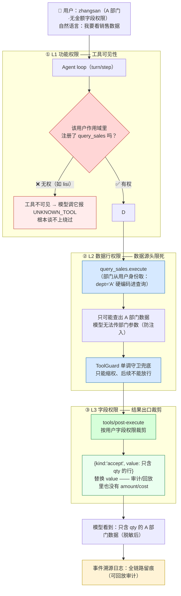
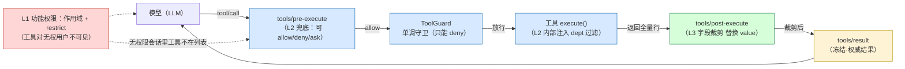
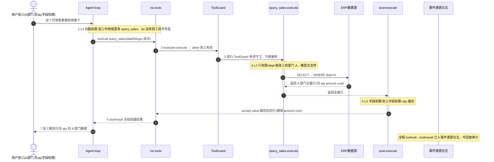
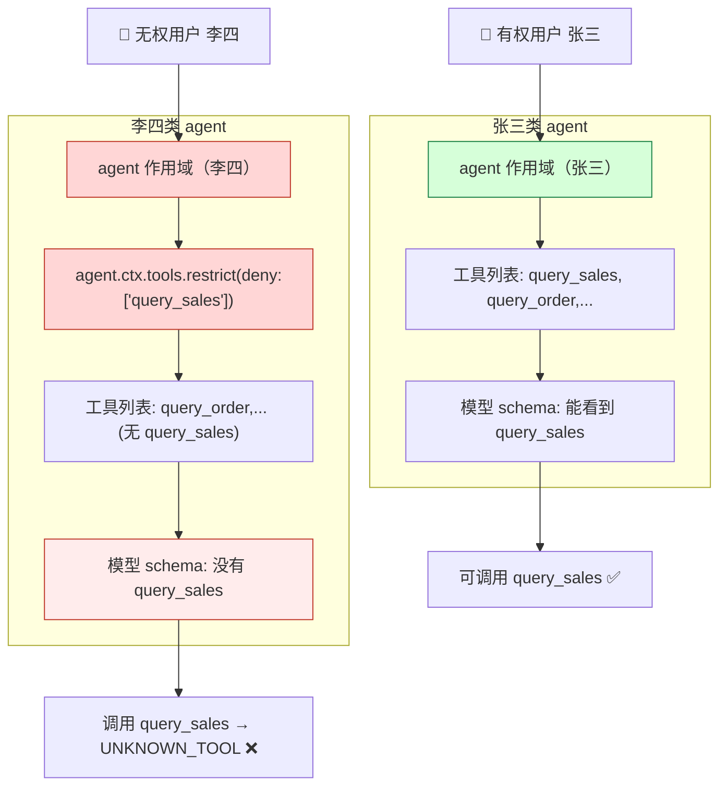
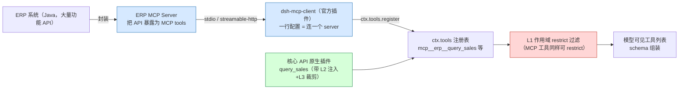

# DSH 在两类 ERP Agent 场景下的优势深度分析

> 定位：给「好业财 ERP 研发团队」和关注企业软件 AI 化的读者看的分析——**从一个 DSH 第一手实践者的视角**，讲清楚用 DSH 做 ERP Agent（给客户用 / 给研发用）的独有优势。
> 前提说明：作者熟悉 DSH 的方式是「真刀真枪用过」——本仓库（deepseek-harness-plugin）就是 DSH 上第六类插件事务，含钉钉桥、定时调度、浏览器阅读、增强 UI、flash-worker 多 Agent 协同。本文的每一条 DSH 特性，要么来自官方源码/doc 实测，要么来自亲身踩坑复盘。
> 目标场景：① **ERP Agent 给客户用**（产品化交付、多租户、可审计）；② **ERP 研发 Agent 给开发/测试用**（内部提效、业务沉淀）。
> 方法：**从 DSH 自带的特性出发**（不假设读者懂其他框架），逐一推导「这个特性在 ERP 场景意味着什么」。

---

## 〇、先立一个总纲：DSH 对"做 ERP Agent"意味着什么

先放下框架对比，直接回答一个问题：**如果我们要给 ERP 做 Agent，通常最头疼的是哪几件事？**

| ERP Agent 的普遍痛点 | 说明 |
| --- | --- |
| **不敢让 AI 乱动业务数据** | 库存、订单、价格——AI 瞎改一笔都是事故 |
| **出了事说不清** | 客户/审计要问"这个数据是谁让 AI 改的？怎么改的？" |
| **要接一堆 ERP 内部接口** | 查库存、下单、审批流、报表，每个都要封装 |
| **不同客户要给不同形态** | 有人要 Web 端、有人要钉钉、有人要嵌进现有系统 |
| **模型成本/合规/信创** | 客户可能指定模型，或要求数据不出内网 |
| **研发自己也要用 AI 提效** | 查代码、跑测试、修 SQL、沉淀团队经验 |

**DSH 的核心主张**：上面的每一项，DSH 都有对应的**第一方特性**（不是插件市场里挑的第三方补丁，而是内核/基础层自带）。下面逐一展开：每个特性 → 它是什么 → 在 ERP 场景里意味着什么。

---

## 一、DSH 特性 → ERP 价值推导（核心，先讲透）

以下特性全部来自 DSH 官方源码/doc 实测 + 本仓库真实使用经历。**每一行都是"DSH 有什么 → 在 ERP 场景意味着什么"。**

### 特性 1：一切皆插件，无特权内核（DSH 的立身之本）
- **是什么**：模型、工具、会话存储、沙箱、审批、定时、UI……全是 Cordis 插件，在配置层自由组合，没有"改不了的内核"。注册即 `ctx.effect()`，卸载自动逆回。
- **ERP 意味着什么**：做 ERP Agent 时，**你要的任何能力几乎都能以插件形式加进去，不用等官方、不用改内核**。比如我们的做法——官方没有"真浏览器阅读"？写一个 `browser-reader` 插件；官方没有"实时文件树"？写一个 client bundle 插件。**对 ERP 来说，这意味着"业务工具接入"是最自然的第一方扩展方式，而不是 hack。**（我们 6 类能力全部是插件这种形态长出来的。）

### 特性 2：事件溯源会话日志 —— 你的 Agent 每一次动作都可回放、可审计
- **是什么**：DSH 的会话是一份 append-only 的 `SessionEvent` 日志，核心不变量是**"模型可见即已记录"**——每次模型输入、每次工具调用、每次子 agent 调度，全部进日志。fork/resume/回放/审计都从这一条事件流派生。
- **ERP 意味着什么**：**这直接解决 ERP 最怕的"AI 说不清"**。
  - 客户问"昨天那个库存调整是谁让 AI 做的？" → 导出会话 jsonl，完整证据链；
  - 出问题想复现 → 把那次会话 **fork** 出来，改个 prompt 再跑，不影响原会话；
  - 合规审计 → 系统提示/思考/工具调用/结果全是日志，不是事后补记。
  - 这是**第一方能力**，不是"我们后来加的日志"——意味着可靠且零成本。

### 特性 3：多 profile = 同一套内核、任意交付形态
- **是什么**：`dsh --profile web`（浏览器 GUI）/ `tui`（终端）/ `headless`（一次性任务，无服务器）/ 自定义 profile（`--patch` 叠出任意形态）。同一内核，外壳不同。
- **ERP 意味着什么**：**给不同客户交付时，不用为每种形态各写一套**。
  - 客户 A 要网页 → `web` profile；
  - 客户 B 在钉钉 → 钉钉桥接器（我们已验证：客户在聊天里直接问）；
  - 你的 ERP 系统内部要接 → headless 一次性任务 / 或通过 `/api` 协议（见特性 4）；
  - 私有化部署 → 全本地、默认不出内网。

### 特性 4：内置 `/api` 外部客户端协议 —— ERP 系统直接"嵌"Agent
- **是什么**：DSH 对外提供 `POST /api/session.prompt`（发消息）+ `WS /api/events.mux`（收事件流）+ `session.create` 等。我们桥接器就是复用这条协议（见 LESSONS.md）。
- **ERP 意味着什么**：**你现有的 Java ERP 不用装 DSH、不用改语言，只要按这个协议调 HTTP/WS，就能把 Agent 当引擎嵌进业务页面**。对"给客户用"是决定性的：客户系统里点按钮 → 调 `/api` → 得到 Agent 能力，前端还是你们的。

### 特性 5：四大使用模式（standard / PTC / minimal / cordis）按会话选
- **是什么**：standard（工具直接给）/ **PTC（Code Mode，模型写程序一次编排多步，官方："five round trips becomes one"）** / minimal（两工具极简）/ cordis（自定义 Agent 创作）。
- **ERP 意味着什么**：
  - 给客户演示/受限环境 → `minimal`，绝对可控；
  - 内部研发多步任务（查三张表→写迁移→跑测试→修 bug）→ `PTC`，一次程序编排、少往返、日志干净；
  - 打造"ERP 专属 Agent"→ `cordis` 起步，复制 preset 加你们的业务工具。

### 特性 6：安全三件套内置——approval 审批 / sandbox 沙箱 / credentials 凭据
- **是什么**：
  - `approval`：按会话策略（`ask` 问人 / `never` 拒绝 / `allowed-once` 单次授权），审批决策是一对审计事件；
  - `sandbox`：按平台分层（Linux bwrap/Landlock、macOS Seatbelt、Windows ACL），按工作区围栏；
  - `credentials`：凭据不进配置，按操作解析、热轮换不重启。
- **ERP 意味着什么**：**这三件套就是 ERP 的"安全红线"**。
  - "创建订单""改库存"这类高危操作 → `approval` 天然触发人工审批（UI 弹窗 / 钉钉推送），**这是产品功能不是补丁**；
  - 多租户/多客户 → 每客户一个工作区 + 沙箱围栏，**防止 AI 跨租户碰数据**；
  - 客户密钥、ERP 接口凭证 → `credentials` 托管，轮换跟操作走、不重启。
  - 这些如果不是内置，自己写会很重——DSH 是第一方能力，且可编程到会话级。

### 特性 7：subagent 多 provider —— 多 Agent 协同 / 不同模型混合
- **是什么**：subagent seam 支持多种 provider，per-agent 模型指定。我们的 `flash-worker` preset：主 agent（pro）规划、flash 子 agent 干活——**两只模型各司其职**。
- **ERP 意味着什么**：复杂任务（跨模块排查、多步报表生成）让"规划型"和"执行型"模型分工；**也支持把外部 agent（如 Codex/Claude Code）当子 agent 用**，不被某一家锁死。

### 特性 8：模型自由 —— 不绑死任何模型
- **是什么**：`ctx.llm` 注册任意 provider——DeepSeek / MiniMax / 任意 OpenAI 兼容端点。
- **ERP 意味着什么**：**客户/公司安全要求指定模型，或要换成本更低的模型 → 改一行配置**。对接国内模型生态（DeepSeek/MiniMax/通义等）零成本，无翻墙依赖。

### 特性 9：一切皆文件、可版本化、可移植
- **是什么**：配置=YAML、会话=jsonl、历史=git 可管理；我们的脚手架 `install-plugins.mjs` 新电脑一条命令装齐。
- **ERP 意味着什么**：**交付/升级可控**——Agent 的"大脑配置"是文件，能进你们的 CI/CD、能 diff、能回滚；客户环境装 Agent 不是黑盒安装，是可审计的配置落地。

### 特性 10：分享会现场可演示的第一手能力（我们已实现的）
- 钉钉里直接和 ERP Agent 对话（桥接器 + 主动推送）
- 真浏览器阅读（web_read 系列，读客户系统页面）
- 自研定时调度（cron-scheduler，每天巡检报表）
- 增强 UI：实时文件树 + git 状态 + 会话状态面板 + 打开 IDE
- flash-worker：pro 指挥、flash 执行
> 这些不是"PPT 里的设想"，是本仓库真实跑通的能力，**都长在 DSH 的插件机制上**——这就是"一切皆插件对 ERP 意味着什么"的最佳注脚。

---

## 二、场景 ①：ERP Agent 给客户用（产品化交付）

### 2.1 这是什么场景
把"自然语言问库存 / 查订单 / 智能分析 / 执行业务操作"做成**产品功能**交付给企业客户。硬约束：**多租户安全隔离、敏感操作审批、全程可审计、部署可控（私有化/本地）**。

### 2.2 DSH 的优势逐条落位（对应用户痛点）

**优势 1：audit-ready——事件溯源日志 = 现成的合规审计（特性 2）**
客户 ERP 最怕"AI 干了什么说不清"。DSH 把**每一次模型输入、每次工具调用、每个结果、每次子 agent 调度**全写进 append-only 会话日志，而且"模型可见即已记录"是运行时不变量（不是事后补记）。这意味着：
- AI 对客户数据做的每一次操作，都能回放重建；
- 出了纠纷/审计，把 jsonl 导出来就是完整证据链；
- 想复现/排查 → fork 那次会话，改个条件重跑，不影响原记录。
**这是 DSH 的内核能力，不是你额外加的日志**——可靠、零成本、客户可验收。

**优势 2：审批 = 产品功能而非补丁（特性 6）**
ERP 的"创建订单/改库存/删数据"这类高危操作，产品上必须有人工审批。DSH 的 `approval` seam 是**内置的一等公民**：
- `ask` 策略天然触发人类应答（UI 弹窗/桥接器推钉钉）；
- `never` 策略兜底拒绝；`allowed-once` 单次授权；
- 审批决策是一对审计事件（`approval/asked` + `approval/decided`），进日志。
意味着：**"高危操作必须人来拍板"在 DSH 里是开关,不是你要写的代码**——会话级切策略（有的客户要严格、有的要放行）。

**优势 3：多租户隔离的天然抓手（特性 6）**
DSH 的沙箱是**按平台分层 + 按会话工作区围栏**的（Linux bwrap/Landlock、macOS Seatbelt、Windows ACL）。配合 `permission-presets`（read-only / workspace-write / danger-full-access），你能在**配置层**控制"每个客户会话能碰什么"，而不是在代码里写死。多租户 = 每客户一个工作区 + 沙箱围栏 + 凭据隔离（credentials 按操作解析、热轮换不重启）。

**优势 4：交付形态自由（特性 3 + 4）—— 这是"给客户"的核心差异化**
DSH 同一内核可以切出多种交付形态：
| 客户场景 | 交付形态 |
| --- | --- |
| Web 端客户用 | `dsh --profile web`（浏览器 GUI）|
| 钉钉/企微客户用 | 钉钉桥接器（我们已验证）→ 客户在聊天里直接问 |
| CLI/脚本接进 ERP | `dsh --profile headless "任务"`（无服务器，跑完即退）|
| 嵌进你们的 ERP 产品 | `/api` 协议（`session.prompt` + `events.mux`）→ 你写壳，DSH 当 Agent 引擎 |
| 私有化部署 | 全本地/本地优先，默认不出内网 |

> **关键洞察**：前端、Agent、安全、审计这些"通用轮子"，在 DSH 里是 profile 层的选择，不是 coding 工作量。**你的 ERP 只要调 `/api` 就能获得整套 Agent 能力**，壳（前端/业务页面）还是你们的。

**优势 5：模型可替换 = 不被某一家模型锁死（特性 8）**
给客户交付时，客户可能指定模型（信创/合规/成本）。DSH 的 `ctx.llm` 能注册 DeepSeek、MiniMax、任意 OpenAI 兼容端点。客户要换模型 = 改一行配置，不是重写适配。

### 2.3 客户向场景的一句话结论
> **"把 AI 能力产品化交付给客户"，DSH 把审计、审批、沙箱隔离、多形态交付、模型自由全都做成了第一方能力，且可编程到会话级。** 你要做的是业务工具 + 业务知识，剩下的由 DSH 承担。

---

## 三、场景 ②：ERP 研发 Agent 给开发/测试用（内部提效）

### 3.1 这是什么场景
团队 8 人，业务域库存/仓储/配送。研发 Agent 用来：读 Java ERP 代码库、写迁移脚本、跑测试修 bug、**慢 SQL 治理**、**UI-AI 录制回放**、沉淀**团队 Skill**。

### 3.2 DSH 的优势逐条落位

**优势 1：PTC 模式 = 一次程序编排，审计完整的工程执行（特性 5）**
ERP 研发打标场景（"读三个表 → 写迁移 → 跑测试 → 修 bug"）在 standard 模式是 3-5 次 LLM 往返，在 **PTC（Code Mode）** 下模型写一个 TypeScript 程序、`run_code` 一次执行完。官方原话："a sequence that would be five round trips becomes one." 对研发提效的直接收益：快、可复现、日志干净。

**优势 2：慢 SQL 治理的正规军（特性 2）**
研发方向里有"慢 SQL 治理"。DSH 的事件溯源日志把**每次工具调用、每次查询、每次结果**都记录下来——这意味着你能拿到"Agent 当时实际执行了什么 SQL、返回了什么"的完整轨迹。**这是可查询、可回放、可 fork 重放的工程资产**，不是事后拍的日志。慢 SQL 发现 → 回放到当时上下文 → 让 Agent 修复 → 再回放验证，是一个闭环。

**优势 3：UI-AI 录制/回放的底座（特性 2 + 特性 7）**
DSH 的会话可以 **fork**：把一次出问题的会话 fork 出来，改个 prompt/工具再跑，不影响原会话。这正好支撑"UI-AI 录制智能回放"——录制的是一次完整 Agent 轨迹，回放是再过一遍。加上 subagent 多 provider（特性 7），可以让不同模型换着跑同一个任务对比效果。

**优势 4：团队 Skill 沉淀 = 可版本化的工程资产（特性 1 + 特性 9）**
DSH 的 skills 是插件（`SKILL.md`），配 `skill-filesystem` 自动注入相关上下文。团队想把"库存异常排查 SOP""仓储配送标准流程"沉淀成 skill：
- skill = 文本文件 → git 可管理 → 随版本分发；
- 团队 Agent 会自动按需加载对应 skill；
- **"知识 = 文件"是最轻的团队资产化方式**——不依赖某个平台画布，纯文本可 review、可评审。

**优势 5：多 profile = 研发流水线一条龙（特性 3）**
| 研发环节 | DSH 形态 |
| --- | --- |
| 日常问答/定位 | `standard` 会话 |
| 多步工程（迁移/重构/测试） | `code`（PTC）会话 |
| CI 里跑回归/批量 | `headless "任务"` |
| 自定义 ERP 专属 Agent | `cordis` 起步 → 复制成 `erp-dev` preset |
| 钉钉里让 Agent 干活 | 钉钉桥接器 |

**优势 6：pro 指挥 flash 执行 = 成本与质量平衡（特性 7）**
本仓库已验证的 `flash-worker` preset：主 agent（pro）规划/review，flash 子 agent 干具体活。对 ERP 研发团队意味着：复杂任务质量在线、日常成本可控、多人共享同一套协同模式。

### 3.3 研发向场景的一句话结论
> **"研发内部提效 + 沉淀团队工程资产"**：PTC 模式（多步工程一次编排）、事件溯源回放（可诊断、可复现）、Skill 文件化（团队经验可版本化）、多 profile 流水线（研发全环节一个内核）。

---

## 四、用 DSH 落地 ERP Agent：技术路径（从特性出发）

不预设任何"要从别的框架迁移"，这里直接从"我们手上有什么 DSH 能力"出发，讲清楚 ERP Agent 怎么搭。

### 4.1 一个 ERP Agent 的最小骨架（全用 DSH 能力）

```text
┌── 接入层（任选）────────────────────────────┐
│  web profile（GUI） ／ 钉钉桥接器 ／ /api 协议 / headless  │
├── Agent 层（DSH 内核）──────────────────────┤
│  agent loop（turn/step）＋ 审批 approval     │
│  ＋ 沙箱 sandbox ＋ 会话事件日志（审计）        │
├── 业务工具层（你写的插件）───────────────────┤
│  查询库存 / 下单 / 报表 / RAG 知识库（各是一个 DSH 工具）│
└── 模型层（ctx.llm，可换任意 provider）───────┘
```

- **接入层**：客户在哪个入口用，就挂哪个 profile/桥接器（特性 3+4）；
- **Agent 层**：DSH 全套，不用写循环/审批/审计；
- **业务工具层**：把 ERP 接口包成 DSH 工具（`ctx.tools.register`，写 schema 给模型看）——这是我们最熟悉的部分（6 类能力都是这么长出来的，见 §3）；
- **模型层**：`ctx.llm` 指到 DeepSeek/客户指定模型。

### 4.2 本仓库已有的"ERP 可复用积木"（不是设想，是已验证）

| 验证过的能力 | 用到哪 |
| --- | --- |
| 钉钉桥接器 + 主动推送 | 客户在钉钉问库存 → Agent 回答；定时巡检结果主动推钉钉 |
| browser-reader（web_read 系列） | Agent 打开 ERP 页面**读渲染后的内容**（读报表/查页面状态）|
| cron-scheduler + 官方 schedule | 每天定时跑库存预警/报表巡检，Agent 到期自动处理 |
| minimax-search | Agent 的 web 搜索能力（查政策/查资料）|
| ui-enhance（文件树/状态面板/IDE） | 研发用的增强界面 |
| flash-worker（pro 指挥 flash） | 复杂 ERP 任务质量与成本平衡 |

> 这些能力相当于"ERP Agent 的工具箱是现成的"，你接下来要做的是**把 ERP 自己的接口包成工具挂进去**——这就是 DSH 让 ERP Agent 的"冷启动成本"大幅降低的含义。

### 4.3 和"自己从零搭"相比，DSH 免掉了什么

| 从零搭要自己做的 | DSH 里已经是内置 |
| --- | --- |
| agent 循环（turn/step/工具流水线/重试） | ✅ 内核 |
| 审计/回放/分叉 | ✅ 事件溯源日志 |
| 审批/权限/沙箱/凭据 | ✅ approval/sandbox/credentials |
| 前端 / 多种入口 | ✅ web/tui/headless + /api + 桥接 |
| 模型切换 | ✅ ctx.llm |
| 子 agent / 多模型协同 | ✅ subagent seam |
| 团队知识沉淀 | ✅ skills（文件化）|
| **你真正要写的只剩** | **业务工具、业务知识、业务规则** |

---

## 五、具体场景设计：ERP 三层权限控制（功能 / 数据行 / 字段）

> 这是把上一章"DSH 能力"落到真实业务的关键案例：**用户想看销售数据，但 ERP 有三层权限**：
> - **L1 功能权限**：这个人能不能用"查销售数据"这个功能；
> - **L2 数据行权限**：只能看 A 部门的数据，看不到 B 部门的；
> - **L3 字段权限**：能看到"销售数量"，看不到"销售金额""商品成本金额"。

### 5.1 设计原则：每一层用 DSH 的一个机制，而不是写在一个大 if 里

DSH 的**工具执行流水线**本质是一条"权限可以分层介入的管道"。三层权限分别落在三个不同的环节，模型在中间任何一个环节都绕不过去：



**为什么这样分层最好：**
- **L1 不给模型看的工具**，比"让模型别调"强一万倍——模型根本不知道存在；
- **L2 在工具内部（数据源侧）限死**，比在返回后过滤更可靠——查询层面就只可能拿到 A 部门的数据；
- **L3 在结果出口裁剪**，且必须"替换 value"而非只换显示文本（官方明确：内容替换是展示策略而非保密策略，要藏值必须替换 value/block）。

### 5.1b 三层权限在 DSH 工具流水线上的落点（总图）



### 5.2 逐层实现（用 DSH 的真实机制）

**L1 功能权限 → 作用域注册 + ToolRestriction（工具可不可见）**
- 思路：把"查看销售数据"做成一个（或一组）工具，按用户角色**只注册到该用户的作用域**，或对该作用域做 **ToolRestriction 过滤**；
- DSH 机制：`ctx.tools.register`（全局）＋ scope（每个 agent 一个作用域）＋ `ToolRestriction`（对作用域的实时过滤，allow/deny 列表）；
- 效果：无权用户 → 工具不在其可见列表 → **模型调用时报 `UNKNOWN_TOOL`**，审计里也留痕；
- 对应你的 ERP：L1 的"功能权限表"决定"给哪个作用域注册/过滤掉哪些工具"。

**L2 数据行权限 → 工具内部注入+守卫（数据范围）**
- 思路：**权限信息进工具执行上下文**，工具内部照着过滤——这是最可靠的（数据在源头就被限死）；
- DSH 机制二选一：
  - **工具内部**（推荐）：工具 `execute(args, exec)` 里，从会话/凭据/上下文拿到当前用户 → 拼进查询（`WHERE dept = 用户的部门`）。工具是"带了权限的查询"，不是通用查询；
  - **`tools/pre-execute` + `ToolGuard`**（兜底）：在调用前校验"这个用户对这批数据有没有权"，`deny` 返回拒绝理由；`ToolGuard` 是**单调守卫**——只能缩权、后面的监听器不能把它再放行，所以不可能被绕过；
- 对应你的 ERP：L2 的"数据行权限表"决定工具内部注入什么过滤条件（部门/组织/数据范围）。

**L3 字段权限 → tools/post-execute 结果裁剪（能看到哪些列）**
- 思路：工具返回**全量**结果后，按用户的字段权限在**出口**裁剪；
- DSH 机制：`tools/post-execute` 监听器返回 `{ kind: 'accept', value: 裁剪后的值 }`（替换 value，重新校验）或 `{ kind: 'block', feedback: ... }`（整条拒绝）；
- 官方指引（重要）：要隐藏程序化值（金额/成本），必须**替换 `value`** 把字段真正拿掉，而不是只换给模型看的文字——否则审计/回放里还能看到；
- 对应你的 ERP：L3 的"字段权限表"决定 `post-execute` 裁剪哪些 JSON 字段（如 `amount`/`cost` → 返回时剔除）。

### 5.3 一次"查销售数据"请求如何运作（完整时序）



**这个时序图读法（每一步谁做什么）：**
| 步骤 | 环节 | 权限/动作 |
| --- | --- | --- |
| ① | L1 功能权限 | 张三作用域里有工具 → 模型看得到；lisi 作用域里没有 → 模型看不到 |
| ③④ | L2 兜底 | `pre-execute` + `ToolGuard`：有权→allow；guard 只能 deny 不能反悔 |
| ⑤ | L2 行权限 | `execute` 内部取用户部门、硬编码进 SQL——**模型传不了 dept（schema 无此参数，防注入）** |
| ⑥ | L3 字段权限 | `post-execute` 出口裁剪，**替换 value** 删掉 amount/cost |
| ⑦⑧ | 交付 | 模型看到脱敏后的数据；全程入事件溯源日志 |

> 代码形态参考（不在正文展开）：工具 schema 只暴露业务参数（`dateRange`），不暴露 `dept`；`post-execute` 用 `{kind:'accept', value: 裁剪值}` 替换 value——需要时再补完整示例。

### 5.4 为什么这个设计"比在业务代码里写 if 强"

| 维度 | 你的 ERP 现在（可能的方式） | DSH 设计 |
| --- | --- | --- |
| 功能权限 | 前端隐藏按钮 + 后端接口校验 | 模型**看不到**工具（作用域/过滤）——最强，且无法被 prompt 绕过 |
| 行权限 | 业务 service 里拼 SQL 条件 | 工具内部注入（数据源头限死）＋ `ToolGuard` 单调守卫兜底（只能缩权）|
| 字段权限 | 查询后代码删字段 | `post-execute` 出口删字段且**替换 value**——审计/回放里也没有 |
| 审计 | 自己打日志 | DSH 事件溯源自动记录每一步（含 deny/裁剪前原始值）——天然合规证据 |
| 审批补丁 | 高危操作另写审批 | `approval` seam 直接挂（L1/L2 里 `ask` 触发人批）|

> **一句话**：DSH 把"权限"从"散落在业务代码里的 if"变成了"工具流水线上的几个环节"——L1 管"看得到吗"、L2 管"拿得到哪些行"、L3 管"看得见哪些列"，**模型全程在管道的包裹里，没有任何环节能绕过**，而每一步又天然进审计。

### 5.5 诚实边界：这套设计不是 DSH 特有，差异在"开箱程度 + 结构保证"

**先说结论：你说得对。"工具调用前拦截 + 工具内部限数据 + 返回后裁剪"这种三层设计思路，其他 agent 框架也能做。** 以 openclaw 为例（本机有源码，实测确认）它确实具备：
- `before_tool_call` policy（工具前策略：插件钩子 + 审批 + 循环检测）
- per-agent / per-sender / per-group 工具策略（≈ L1 功能权限）
- workspace-root-guard（≈ 沙箱围栏）
- exec-approvals（≈ 审批）

所以**绝不能把"能做三层权限"说成 DSH 独有**。下面这张表讲的是**真实差异**——不是"能不能做"，而是"怎么做 / 做到什么程度 / 附带什么保证"：

| 环节 | 谁都能做（思路） | DSH 的具体差异点 |
| --- | --- | --- |
| L1 功能权限 | 按角色过滤工具 | DSH 在**配置层/作用域层**声明（`cordis.patch.yml` + agent preset），不改代码；工具对无权用户**不出现在 model schema**（"模型不知道存在"是结构保证，不是靠自觉）|
| L2 行权限 | 工具内注入 + 前置校验 | DSH 的 **ToolGuard 是单调守卫：只能缩权、后面的监听器无法反悔**（语义保证）；`exec.agent` 在工具里直接拿到"谁在调用" |
| L3 字段权限 | 返回后裁剪 | DSH 的 `post-execute` 是流水线一等环节，官方明确"要藏值必须替换 value 而非换文字"——**防止审计/回放泄露是文档化的设计** |
| 审计 | 自己打日志 | DSH 事件溯源日志是**内核**：tool/call→tool/result 自动持久化、可回放可 fork，不用另接存储 |

**一句话**：三层权限的**设计思路**任何框架都能做（openclaw、LangGraph、甚至手写 if）。DSH 的差异是——**这些环节内建且带结构保证（单调守卫、替换 value 防泄露、事件溯源自动审计），加上作用域/配置层声明免写代码**。选型时按"你要不要这些开箱保证 + 全量审计"来权衡，而不是"谁才能做三层权限"。

### 5.6 L1 功能权限具体怎么做（插件骨架 + 架构图）

> 本节回答"L1 到底怎么落地、写什么样的插件"。核心思想一句话：**让无权用户的"模型可见工具列表"里根本没有 `query_sales`**——不是"调用了再拦"，而是"模型根本不知道这个工具存在"。

#### 5.6.1 两条 DSH 原生途径（二选一或组合）

| 途径 | 做法 | 说明 |
| --- | --- | --- |
| **A. agent 作用域注册** | 工具注册到"某个 agent 的作用域"（`agent.ctx.tools.register(...)`），有权用户才有，无权用户不注册 | 工具对无权 agent 的 model schema 不可见 |
| **B. `agent.ctx.tools.restrict()`**（推荐） | 官方为"每个 agent 不同工具可见性"设计的原语：`allow: ['query_sales']`（只留这些）或 `deny: ['query_sales']`（移除） | 只能在 agent 作用域用；**全局调用会直接报错**（源码：`tools.restrict() requires a scoped context (agent.ctx)`，防止误伤所有 agent）；可热更新 |

> 两者本质相同：都是"作用域级"声明工具可见性。推荐 B（restrict），因为是官方为此设计的原语、误用会被拦截。

#### 5.6.2 插件骨架（结构示意，非部署代码）

```js
// plugins/erp-permission/erp-permission.mjs — L1 功能权限插件
export const inject = ['tools']          // 需要 tools 服务（restrict 在 ctx.tools 上）
export function apply(ctx, config) {
  // 权限来源：config.users（id → canSeeSales）；真实 ERP 换成"登录人 + 权限服务"
  const canSeeSales = (userId) =>
    (config.users || []).find(u => u.id === userId)?.canSeeSales ?? false

  // 🔑 关键插桩点：在 agent 作用域世界里按用户权限 restrict
  ctx.on('agent/created', (agent) => {   // 或更早：ctx.agents.setup（先于首个提示词）
    const userId = agent.ctx.user?.id ?? config.defaultUser
    if (!canSeeSales(userId)) {
      // 无权 → 从该 agent 的工具可见列表里移除查销售工具
      agent.ctx.tools.restrict({ deny: ['query_sales'] })
      // 有权 → 不 restrict（工具保持可见）；或 allow: [...]
    }
  })
}
```

> 说明：`agent.ctx` 是 agent 作用域上下文（官方文档：agent-scoped context，贡献 agent-local、卸载逆回）；`agent.ctx.tools.restrict()` 是作用域级原语。真实 ERP 里 `userId` 来自会话绑定的登录人，权限查你的权限服务。

#### 5.6.3 L1 运作架构图



**运作三步：**
1. agent 创建时，按当前用户权限调用 `restrict`（或作用域注册）；
2. 无权用户 → `query_sales` 从他的工具可见列表消失 → **模型 schema 里没有它**；
3. 即便模型（或恶意 prompt）试图调用 → DSH 报 `UNKNOWN_TOOL`，无执行、留审计。

**L1 / L2 / L3 分工再强调（防止混淆）：**
```
L1：工具【可不可见】   ← 作用域 / restrict（模型不知道 = 最强）
L2：工具【拿得到哪些行】← execute 内部注入 dept（数据源头）
L3：工具【看得见哪些列】← post-execute 裁剪（出口）
```

### 5.7 ERP 很多功能 API 怎么批量加载（MCP + 原生 + 官方三层）

> 前面的例子只讲了单个工具。真实 ERP 有几十上百个功能 API（查库存/下单/报表/字典/审批流…），这一节讲**整套工具集怎么加载**。

#### 5.7.1 三层加载策略（一次讲清）

DSH 加载 ERP 工具集的官方机制（均有源码/doc 实证）：

| 层 | 机制 | 适用 | 工具名的样子 |
| --- | --- | --- | --- |
| **① 原生工具插件**（推荐给核心 API） | 写 DSH 宿主插件，`ctx.tools.register`，自带 schema + L2 注入 + L3 裁剪 | 核心业务 API（销售/库存/下单——高敏、要权限审计）| `query_sales`（干净的名字，可挂 post-execute）|
| **② MCP client 批量挂载**（推荐给大量外围 API） | DSH 官方 `dsh-mcp-client` 插件，连接你的 ERP MCP server，**工具自动注册进 `ctx.tools`** | 报表/字典/配置等大量低敏 API | `mcp__erp__query_sales`（server 限定名）|
| **③ 官方自带工具**（dsh-base ~80 个） | 出厂就有，零成本 | 文件/命令/搜索/子agent/定时… | `bash` / `edit` / `glob` / `grep` / `subagent`…|

> **MCP client 是"大量 API 批量加载"的关键答案**：你的 ERP 只需提供一个 MCP server（把 API 暴露为 MCP tools），DSH 一行配置连上，全部 API 自动成为 Agent 可调用的原生工具——**不用为每个 API 写插件**。

#### 5.7.2 加载架构图



- **MCP client 细节**（官方 doc 实锤）：连接时 `listTools()` → 每个工具 `ctx.tools.register()` 为 `mcp__<serverName>__<rawName>`；断线自动重连（指数退避）、重连上限可配、重连后旧代工具先保留；`failOnStartupError` 可设为连接失败即拒绝激活。
- **MCP 工具也可被 L1 restrict**：它们注册进 global `ctx.tools`，在 `restrictableNames` 里——`agent.ctx.tools.restrict({deny:['mcp__erp__create_order']})` 同样生效。

#### 5.7.3 配置层写法（一行为一个 server）

```yaml
# cordis.patch.yml —— 挂载 ERP 的 MCP server
- insert:
    - id: mcp-erp            # ERP 业务 API（HTTP）
      name: '@deepseek-ai/dsh-mcp-client'
      config:
        serverName: erp
        transport: streamable-http
        url: http://erp.internal/mcp
        headers:
          Authorization: !!js '`Bearer ${process.env.ERP_MCP_TOKEN}`'

    - id: mcp-erp-report     # 报表 API（stdio，第二个 server）
      name: '@deepseek-ai/dsh-mcp-client'
      config:
        serverName: erp-report
        transport: stdio
        command: npx
        args: ['-y', '@local/erp-report-mcp']
```

模型里就会看到：`mcp__erp__query_sales`、`mcp__erp__create_order`、`mcp__erp_report__daily_report` …

#### 5.7.4 怎么选"原生 vs MCP"（决策表）

| 判断 | 建议 | 原因 |
| --- | --- | --- |
| 核心业务 API（销售/库存/下单，高敏） | **原生工具** | 能挂 L2（注入 dept）/ L3（替换 value 裁剪），权限+审计最强 |
| 外围大量 API（报表/字典/配置） | **MCP client** | 批量挂载零成本，`mcp__erp__*` 开箱即用 |
| 只读/低敏，先接起来跑 | **MCP client 先上** | 快速见效，后面核心 API 再转原生 |

> **一句话**：核心 API 用原生插件（要权限/审计的握在自己手里），外围 API 用 MCP 批量挂（量大省事），通用能力用官方自带——三层互补，DSH 的 `ctx.tools` 是统一注册表，L1 restrict 对三者一视同仁。

---

## 六、落地建议（两步走，从能力验证到立项）

1. **第一步（能力验证，1-2 天）**：拿 1 个真实 ERP 场景跑通最小闭环。
   - **验证清单（照着做）**：
     1. `dsh --profile web` 起一个 web profile，确认 GUI 起来；
     2. 把 1 个 ERP 接口（如查库存）包成 DSH 工具（`ctx.tools.register`，写 schema），patch 进 `cordis.patch.yml`；
     3. 会话里用自然语言问"某 SKU 库存够不够"，确认工具被调用；
     4. 把会话 `approval/policy` 设为 `ask`，确认高危操作（如创建订单）触发审批；
     5. 导出一份会话 jsonl 日志，确认"模型输入/工具调用/结果"全量可回放（审计证据）。
     6. （可选进阶）用第五章的三层权限场景验证：无权限用户查销售数据 → 工具不可见；A 部门用户 → 查不到 B 部门行；无金额字段权限 → 返回没有 amount/cost。
   - 目标：**证明"查库存 → 审批 → 回答 → 审计日志"这条最小链路跑得通（含三层权限链路则更完整）**。
2. **第二步（试点立项）**：二选一先试一个——
   - **给客户**：挑 1 个真实客户场景做 PoC（如钉钉里查库存 + 订单审批），交付形态走桥接器或 /api 嵌入；
   - **给研发**：挑团队痛点（如慢 SQL 治理 / 迁移脚本）做 `erp-dev` preset（PTC + skill），2-3 人试用。
   - **风险对冲**：DSH 是开发者预览，建议**试点项目用 DSH、正式项目并行验证**，不搞一次性大迁移。

---

## 七、风险与边界（不吹不黑）

| 风险 | 说明 | 应对 |
| --- | --- | --- |
| 开发者预览、破坏性变更 | 两周内 0.1.0-rc.8→0.1.1-rc.2 三次 | 锁定版本 + 本仓库 `check-dsh-compat` 契约检查已就绪 |
| 生态年轻 | 官方插件少 | 自研（本仓库 6 类能力都是）+ 持续跟踪上游 |
| 学习曲线 | "配置树/插件/事件"心法需要适应 | 团队选 1-2 人先当"DSH 布道者" |
| 客户部署环境 | 沙箱依赖平台 runner（bwrap/Landlock/Seatbelt/ACL）| 先验证目标环境；不可用可降级 danger-full-access + 审批兜底 |
| DSH 不是万能的 | 给业务的可视化编排（类低代码平台画布）、复杂多 agent 极致定制（需通用代码级编排库）不是它的强项 | DSH 的定位是"自研 Agent 底座"，识别清楚再用 |

---

## 八、一句话总结（给领导/给团队）

> **用 DSH 做 ERP Agent，你不需要从零写 agent 循环、审批、审计、前端、模型接入——这些是 DSH 的第一方能力；你要投入的是把 ERP 业务接口包成工具、沉淀业务知识成 skill、以及设计好审批策略。** 给客户要的是"审计 + 审批 + 多形态交付"，给研发要的是"PTC + 回放 + skill 沉淀"——两条线都落到了 DSH 的现有能力上，风险用「试点先行 + 版本锁定 + 契约检查」控住。
