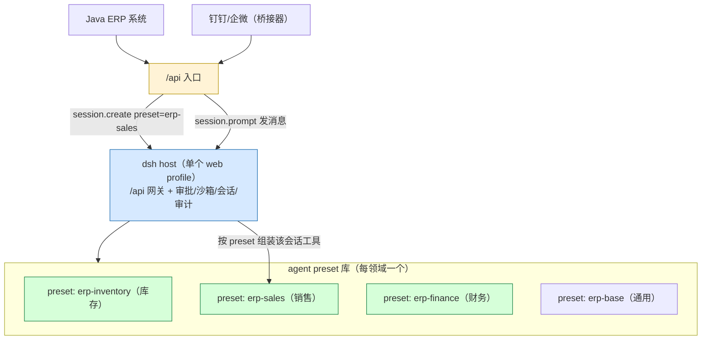

# DSH 分享会：大纲 + 讲稿（15 分钟）

> **定位**：混合听众（没接触过 dsh 的同事 + 技术同学一次兼容）
> **形式**：纯讲干货（不依赖现场演示，各节标注了「可演示」的可选点）
> **时长**：15 分钟（含 1 分钟余量，可按提示压缩/扩充）
> **素材来源**：本人 8/17–8/26 与 dsh 的会话记录（含归档）+ 项目复盘文档
> （[LESSONS.md](./LESSONS.md) / [CRON-SCHEDULER-INCIDENT.md](./CRON-SCHEDULER-INCIDENT.md) /
> [PLUGIN-RESILIENCE.md](./PLUGIN-RESILIENCE.md) / [ARTICLE-DSH-PLUGIN-PRACTICE.md](./ARTICLE-DSH-PLUGIN-PRACTICE.md)）
> **设计态来源**：dsh 官方 git 库（`~/OpenProject/deepseek-harness`，已同步到 `0.1.1-rc.2`）的
> [architecture.zh.md](../deepseek-harness/docs/architecture.zh.md)（配置叠层）、
> [cordis-primer.zh.md](../deepseek-harness/docs/cordis-primer.zh.md)（五个核心概念）、
> [agent-lifecycle.zh.md](../deepseek-harness/docs/agent-lifecycle.zh.md)（轮次时序图）、
> [capability-seams.zh.md](../deepseek-harness/docs/capability-seams.zh.md)（seam 图）、
> [tool-execution-pipeline.zh.md](../deepseek-harness/docs/tool-execution-pipeline.zh.md)（工具流水线图）

---

## 〇、全场总览（15 分钟时间轴）

| 段 | 内容 | 时长 | 页码 |
| --- | --- | --- | --- |
| 1 | 开场：从「一个个人工具箱」讲起 | 1.5 min | §1 |
| 2 | DSH 是什么 + Cordis 设计态 + **定位对比**（含图解） | 4 min | §2（本节重点）|
| 3 | 我的 DSH 之旅：从学习到插件全家福 | 2.5 min | §3 |
| 4 | 三个「把 DSH 搞崩」的真实事故 | 3 min | §4（核心高潮）|
| 5 | 踩坑沉淀：5 条插件铁律 + 三道防线 | 2 min | §5 |
| 6 | 合作模式 × 可移植性：pro 指挥 + 一键安装 | 1 min | §6 |
| 7 | 收尾：经验总结 + 展望 + Q&A 引导 | 1 min | §7 |

**一句话主题（贯穿全场）**：
> 在「一切皆插件」的 dsh 里，写插件不难，难的是**别把自己插件写崩宿主**——
> 我用三次真实崩溃，换来了一套「部署前自检」的地基。

---

## 一、开场：从「一个个人工具箱」讲起（1.5 min）

### 讲稿

大家好。先问一个问题：**你们现在写代码，有哪些环节是 AI 帮不上忙的？**

我自己从 8 月中旬开始，花了两周时间，就干了一件事：**给 DeepSeek 刚开源的 Agent 框架 dsh，搭了一整套属于自己的插件工具箱**——钉钉机器人、浏览器阅读、定时任务、网页搜索、增强 UI、多 Agent 协同，一共 6 类能力。这两个星期里，我把 dsh 搞崩过三次——不是比喻，是字面意义上服务起不来的那种崩。

今天这 15 分钟，我想分享三件事：
1. **dsh 是什么**，为什么它值得你花时间看一眼；
2. 我在这两周**做了什么**——一个插件集合仓库的诞生过程；
3. **三次真实的崩溃事故**，以及从里面沉淀出的、可复用的插件开发方法论。

> 结尾过渡：先花四分钟，把 dsh 和它底下的 Cordis 讲清楚——我会用图，不用术语。

---

## 二、DSH 是什么 + Cordis 设计态（4 min）⭐ 本节重点

> 目标：让没接触过 dsh 的人，通过**图解 + 最小代码 + 一句话类比**真正看懂 Cordis，而不是背抽象名词。

### 2.1 一句话：dsh 是「一叠配置文件 + 一个插件运行时」

**DSH = DeepSeek Harness**，8 月 13 号开源的 Agent 运行框架，MIT。模型、工具、会话、存储、调度、UI……**所有能力都是插件**，没有特权内核——你写的插件和官方内置插件权限一模一样。

先给一个**可验证的第一性图景**。你在终端跑 `dsh --profile web --dump-config`，它会打印出**这台上电后真实组装出来的整棵插件树**。所谓配置文件，就是按序叠放的一摞「层」，后一层 patch 前一层：

```text
空条目列表
  └─ dsh-base 组合包        ← 模型/工具/会话/沙箱/审批/设置/凭据（每个 profile 的第一层）
       └─ dsh-web-app 组合包  ← 浏览器应用（web profile 才有）
            └─ 用户 profile 的 cordis.patch.yml   ← 我们的插件在这里插入
                 └─ home 级 patch
                      └─ --patch overlay（临时）
```

> `--dump-config` 打印出的任何条目，都能被你的 patch 替换。**「配置即编程」不是宣传语**——四种运行模式（standard / code / minimal / cordis）其实就是四份 `agent.cordis.yml`，差异只是"挂载哪些插件行"。

#### 2.1.1 实例：本机 Web Profile 安装目录（现场可指给人看）

这套叠层在我们机器上是真实存在的，目录就在 `~/.dsh/profiles/web/`，可以直接现场 `ls` / `cat` 给人看：

```text
~/.dsh/profiles/web/
├── cordis.yml           # profile 根 = []（空条目列表，树全靠 patch 叠出）
├── cordis.patch.yml     # ⭐ 我们的 5 条插件引用都在这里（用户 patch 层）
├── package.json         # 声明 profile = dsh-base + dsh-web-app 两个 bundle
├── node_modules/        # 只有自定义依赖
│   ├── @dsh-local/ui-enhance/   ← file: 软链到你的仓库源码（改源码→重建即生效）
│   └── playwright-core/
└── plugins/             # 三个自研宿主插件（复制进 profile，改源码要重新 install）
    ├── browser-reader/     (browser-reader.mjs + skills/)
    ├── cron-scheduler/     (cron-scheduler.mjs + cron.js + scheduler.js)
    └── minimax-search/     (minimax-search.mjs)
```

对照口诀：**`cordis.yml` 是舞台（空），`package.json` 说明搭哪两个布景（bundle），`cordis.patch.yml` 是主角（我们的插件）**。

而 `cordis.patch.yml` 的实际内容（5 条 insert + 2 条配置覆盖）就是 §2.3 最小插件行的"放大版"，现场打开这个文件就能讲：

| id | 类型 | 一句话 |
| --- | --- | --- |
| `minimax-search` | 宿主插件 | `./plugins/minimax-search/minimax-search.mjs`——注册为 web 搜索 |
| `schedule` | 官方插件 | `@deepseek-ai/dsh-schedule`——官方定时 |
| `cron-scheduler` | 宿主插件 | `./plugins/cron-scheduler/cron-scheduler.mjs`——自研 cron |
| `browser-reader` | 宿主插件 | `./plugins/browser-reader/browser-reader.mjs`——真浏览器阅读 |
| `ui-enhance` | client bundle | `@dsh-local/ui-enhance`——增强 UI（file: 软链源码） |

外加：`web-search-deepseek: disabled` + `web.searchProvider: minimax`（禁用官方搜索、指向 MiniMax）。

> 现场话术：**"这就是刚才那叠配置层在真实磁盘上的样子——`cordis.yml` 空着，`patch.yml` 装满。所有东西都在配置文件里声明，没有魔法。"**

#### 2.1.2 实例：`bundles` 就是 dsh 自带的「出厂插件层」

上面 `package.json` 里那行 `dsh.profile.bundles` 是什么？——它是 profile 声明"**我要叠哪几层官方出厂配置**"的清单。每个 bundle 是一个 npm 包，包里除了代码还带一份 `cordis.patch.yml`（经 `dsh.bundle.patch` 字段指向），dsh 启动时把各份 patch **按序叠在空 profile 根之上**。

dsh 官方一共就 **3 个自带 bundle**（`packages/bundle/`）：

| bundle | 默认在哪个 profile | 一句话职责 |
| --- | --- | --- |
| `@deepseek-ai/dsh-base` | 所有 profile | **核心基座**：模型/会话/工具/沙箱/审批/设置/凭据/subagent/定时…每个 profile 的第一层 |
| `@deepseek-ai/dsh-web-app` | web | 在 base 之上加**浏览器表面**：Web 服务器、UI 渲染、client runtime、API 网关 |
| `@deepseek-ai/dsh-headless` | headless | 在 base 之上加**一次性任务运行器**：无服务器，跑完打印结果就退出 |

> 我们的 `web` profile = `base + web-app` 两层，然后你的 patch 叠上去。所以最终跑的插件树 ≈ **base 的 ~80 行 + web-app 的 ~30 行 + 我们的 5 行**。

**`dsh-base` 装了什么（按类拆）**——现场如果被问"dsh 出厂到底带哪些能力"，背这张表：

| 类别 | base 提供的插件 |
| --- | --- |
| 模型 | `llm` / `llm-deepseek` / `llm-pi-ai` / `llm-retry` / `agent-default-model` / `token-meter` |
| 会话/持久化 | `session` / `session-persistence-jsonl` / `session-query-sqlite` / `session-projection` / `session-title*` / `session-telemetry-otel` / `compaction-basic` |
| Agent 核心 | `agent` / `agent-loop` / `system-prompt` / `agent-instructions` / `tools` / `skill*` / `plan-mode` / `goal*` |
| 工具 | `tool-bash`/`tool-pwsh` / `tool-fs*` / `tool-skill` / `tool-subagent*` / `tool-workflow` / `tool-todo` / `tool-web` / `tool-str-replace-editor` / `tool-result-pruner` |
| subagent | `subagent*` / `subagent-spawn-in-process` / `subagent-fork-in-process` / `tool-subagent-control`/`-report` |
| 安全 | `sandbox` / `sandbox-policy` / `bash-sandbox` / `pwsh-sandbox` / `fs-sandbox` / `approval` / `permission` / `fs-observation-policy` |
| 调度/任务 | `jobs` / `schedule` / `timeout-policy` / `spill-local` / `spill-policy` |
| 其它基础设施 | `timer` / `hmr` / `typert*` / `typert-gateway` / `user-questions` / `settings` / `credentials` / `commands` / `web` / `web-search-deepseek` / `shell-env` / `subprocess` |

**`dsh-web-app` 装了什么**——全是"浏览器表面"：`webserver`/`web-runtime`/`web-startup`/`modules`/`connection`/`client-runtime`/`api-gateway`/`ui-theme`/`ui-layout`/`ui-renderer`/`ui-sidebar`/`ui-settings*`/`workspace`/`storage*`/`session-log-download`/`message-feedback`/`session-stats`/`directory-picker`/`plugin-inventory`/`code-runtime` 等（还覆盖 base 的 `system-prompt` persona、禁用 `hmr`、`session-query-sqlite` 内存索引、`tools` 的 Code Mode 开关）。

**两个关键含义**（现场可强调）：
1. **"配置即编程"的最直接证据**：四种运行模式（standard / code / minimal / cordis）不是四套代码，而是**四份不同的 `agent.cordis.yml`**，叠在同一些 bundle 上，只差挂哪些插件行。`dsh-base` 一份 patch 就列出了 dsh 出厂全部基座插件及其安全默认值。
2. **patch 按 id 替换整行 config，不是深合并**：官方明确"patch 替换目标行的整个 config，不存在深度合并层"。所以 `dsh-web-app` 覆盖 `system-prompt` 时要连 persona 一起重述——这也是你能放心在 `cordis.patch.yml` 里 `disabled` 任何默认行的原因（比如我们 `web-search-deepseek: disabled`）。

### 2.2 Cordis 是什么：一句话 + 一张图（把它讲「实」）

**Cordis 就是上面那棵插件树的"加载器 + 生命周期运行时"**，vendor 引入的第三方框架。它只做三件事，每一件都能对应到具体机制：

| 抽象概念 | 一句话直给 | 具体机制 |
| --- | --- | --- |
| **插件** | 带着 `apply(ctx)` 的一段代码，挂上/卸载都有生命周期 | `export function apply(ctx)` 或 `Service` 子类 |
| **上下文 ctx** | 一个"所有服务的容器"，通过稳定 key 找服务 | `ctx.tools` / `ctx.llm` / `ctx.sessions` |
| **inject 声明** | 插件声明"我需要哪些服务"→ 等就绪才启动 | `export const inject = ['webServer']` |
| **可逆副作用** | 注册即 effect；卸载自动逆回（装透明、卸无痕） | `ctx.effect()` / `ctx.on()` |
| **事件通信** | 服务间靠类型化事件协作（不是函数调用） | `emit` / `waterfall` / `parallel` / `serial` |

**一句话类比**（讲给没写过插件的人）：

> 把 dsh 想象成一间**机器工厂**。Cordis 是厂房管理系统：每台机器（插件）进场时**声明"我要用电、要气管"**（inject），插上后**登记它改动了哪些管线**（effect），下班拔掉时**系统自动把管线恢复原样**（可逆副作用）。厂房不会因为哪台机器没声明用电就偷偷给它通电——没声明就碰电闸，直接跳闸报警（inject 门禁，后面 §4 事故 1 会用到）。

### 2.3 最小插件长什么样（30 秒讲完，效果立竿见影）

```yaml
# cordis.patch.yml —— 插一条插件行
- insert:
    - id: my-tool
      name: ./plugins/my-tool/my-tool.mjs
```

```js
// my-tool.mjs —— 插件本体：注册一个工具
export const inject = ['tools']
export function apply(ctx) {
  ctx.tools.register({
    name: 'read_doc', description: '读文档',
    parameters: { path: { type: 'string', required: true } },
    async execute(args) { return readFile(args.path) },
  })
}
```

> **"万物皆插件"的实证**：上面这段代码，就是 dsh 里"添加一个 AI 能调用的能力"的全部成本。模型、搜索、定时、UI 都长这样——只是挂载点不同（§3 全家福会展示我们实际挂的 6 类）。

### 2.4 一次对话背后的时序（看懂这张图，Cordis 就通了）

官方有一张[轮次时序图](https://github.com/deepseek-ai/deepseek-harness/blob/master/docs/agent-lifecycle.zh.md)，把"用户说一句话 → AI 干活 → 回你"的完整链路画出来了。简化成关键六步：
```text
用户输入 ──► turn/start          ← 开启一个"轮次"(turn)
  claim 输入 ──► 组装提示词+工具schema
  ──► agent/request ──► llm/stream   ← 调模型，流式输出 assistant/chunk*
  ──► 模型要调工具 ──► tool/call ──► tools/pre-execute ──► execute ──► tool/result*
  ──► step/end（还欠工作 → 再起一个 step）
  ──► turn/end（不欠了）──► 回复你
```

**两个关键设计点（也是后面事故2、事故3的伏笔）**：
1. **会话日志 = 事件溯源**。上面每一步都往 append-only 的 `SessionEvent` 日志写一条（`turn/*`、`user/message`、`assistant/*`、`tool/*`）——**模型可见即已记录**，回放/分叉/审计全靠它。所以往日志里写 DSH 不认识的事件 = 毁掉整个历史（§4 事故 2）。
2. **`pre-step`/`request`/`llm/stream`/三个 `tools/*` 是 waterfall 事件**：监听器必须 `next()` 委托下去——这就是"钩子/拦截"的设计态：审批、脱敏、重试全挂在这几个点，不用改循环本身。

### 2.5 为什么值得关注（10 秒版，正文一句带过就行）

1. **能改一切**：官方没有的「真浏览器阅读」「实时文件树」，插件层自己补上了（马上 §3 展示）；
2. **早期红利**：8/13 才开源，两周内 `0.1.0-rc.8 → 0.1.1-rc.2`，现在入场能拿到第一波稀缺经验；
3. **理念可迁移**：理解了「一切皆插件 + 事件溯源 + 沙箱」，换任何 Agent 框架都通用。

### 2.6 一句话定位：dsh 站在一个很少有人占过的位置（本次重点）

> **dsh 比 openclaw 这类「个人助理」更轻、比 LangGraph/ADK 这类「纯 SDK」更完整、比 Claude Code / Codex 这类「闭源成品」更开放；而这个位置之所以能站住，全靠「插件一等公民」——定制场景既不难、又不受限。**

展开成四维（每个方向一句话，讲稿选 2-3 个讲）：

| 对比方向 | 一句话 | 关键依据 |
| --- | --- | --- |
| **vs 轻量工具**（openclaw 个人助理） | dsh **更轻**——openclaw 是"个人助理 + 一堆聊天渠道"的重型成品；dsh 是内核 + 配置树，不带预设业务，你要什么叠什么 | openclaw 定位 personal AI assistant（20+ 渠道）；dsh = Agent 运行时底座 |
| **vs Agent SDK**（LangGraph/ADK） | dsh **完整度高**——SDK 给你零件库（图/状态/编排），dsh 给你整机 + 图纸：agent 循环、会话、沙箱、审批、UI、/api 全内置，不用从零焊 | SDK 要自己搭 loop/审计/UI；dsh ~80 行 base 插件开箱即用 |
| **vs 闭源成品**（CC/Codex） | dsh **更开放 + 守通用协议**——全开源、可自托管、模型自由；对外用通用 /api 协议（session.prompt + events.mux，与浏览器/钉钉/你自己的系统同一套），不被锁在自家生态 | `/api` 外部协议官方内置；CC/Codex 绑自家 |
| **多 agent × 多模型**（对齐口径） | 开源 harness（dsh、openclaw 等）**都支持跨厂商多模型**；dsh 是其一，还能把 Codex/CC 当子 agent。CC/Codex 也能给子 agent 换自家档位模型（CC: haiku/sonnet/opus；Codex: gpt-5.4），但换不了别家——**被排除的是闭源成品** | dsh subagent 任意 provider；openclaw `agents.list[].subagents.model` 同样任意 provider（都已实证）|
| **难度/灵活性** | **插件一等公民 = 定制不难、又不失灵活**——加一个 AI 能力 = 一个插件（几分钟）；改到深层（模型/会话/UI）也是插件，不 hack 内核 | 我们 6 类能力全是插件长出来的，见 §3 |

**一句话收束（讲稿照读）**：
> "市面上要么是'能用的成品但改不动'，要么是'随便改但全要自己搭'。dsh 罕见地站在中间：**轻到改得动，完整到不用搭，开放到不自锁，插件机制让它既不复杂、又够灵活。**"

> 结尾过渡：概念用图讲"通"了，定位也清楚了，接下来看我这两周实际干了什么。

---

## 三、我的 DSH 之旅：从学习到插件全家福（2.5 min）

### 3.1 旅程时间线（讲稿）

我的故事分三个阶段：

**第一阶段：学习（8/17）**。DSH 刚开源，我让 dsh 的 Agent 系统精读了本地 105+ 篇官方文档，沉淀成 12 篇结构化学习笔记（`docs/learning/`）——这是后面所有开发的地基——**不是我人肉去读的，是 Agent 读的**。今天你要做 dsh 插件，第一件该做的就是让 AI 帮你把文档吃透，别一上来就写代码。

**第二阶段：第一个杀手级产出——钉钉桥接器（8/17–8/18）**。让 DSH 的 Agent 能直接在我的钉钉里对话。这个阶段我踩了 4 个真实的坑——SDK 预发布域名不可达、心跳误杀连接、**订阅通道选错收不到消息**、事件去重误杀——这些坑最后全沉淀进了复盘文档。

**第三阶段：插件集合线（8/20–8/26）**。从「我想自己用」升级成「做成一个开源仓库」。核心是两大插件 + 配套脚手架。

### 3.2 插件全家福（讲稿 + 速览表）

| 插件 | 形态 | 一句话 |
| --- | --- | --- |
| **钉钉桥接器** | 独立进程 | 在钉钉里直接和 DSH Agent 对话，定时提醒主动推送 |
| **browser-reader** | 宿主插件 | Playwright 驱动真浏览器，确定性读 JS 渲染页面 |
| **minimax-search** | 宿主插件 | 把 MiniMax 搜索注册为 DSH 的 web 搜索，`web_search` 直接可用 |
| **cron-scheduler** | 宿主插件 | 标准 5 字段 cron 定时，跨重启防重复 |
| **ui-enhance** | client bundle 插件 | 增强 UI：会话状态面板、工具调用统计、**右侧实时文件树（git 状态）**、打开 IDE |
| **flash-worker** | agent preset | 「pro 指挥、flash 执行」的两级多 Agent 协同 |

> 有个数据很能说明工作量：这个仓库 **69 次提交、225 个文件、+16438 行/–1057 行、100 个测试用例、3000+ 行文档**——一半是代码，一半是复盘。

### 3.3 两个值得展开的亮点（讲稿）

**亮点 A：右边那个「实时文件树」**。不是静态树——它用 `fs.watch` + SSE，文件一改、一提交，git 状态 M/A/D/U 徽标**即时更新**，不用刷新页面。设计上坚持「只做增量，不覆盖官方渲染器」，这是 client bundle 插件的一条重要纪律。

**亮点 B：一条命令装完全部插件**。DSH 插件有个隐藏痛点：装进 profile 后，引用要手工写进 `cordis.patch.yml`——这直接杀死了可移植性。我的脚手架 `npm run install:plugins` 把「构建 + 自检 + 装进 profile + **自动补 patch 引用**」全包了，新电脑 clone 下来一条命令装完。

> 结尾过渡：到这里都是「美好的一面」。现在讲真正的干货——我是怎么把 dsh 搞崩的。

---

## 四、核心高潮：三个「把 DSH 搞崩」的真实事故（3 min）

> 这一节是全场记忆点，建议讲慢一点，每个事故给足冲突与反转。

### 讲稿

Danger 区域。接下来三个事故，每一个我都真实踩过，每一个都让 `dsh web` 启动直接崩溃。而且我要先说结论：**这不是 dsh 的 bug，是它的设计哲学——「fail-loud，启动时响亮失败」。** 官方认为：一个工具插件挂了若静默继续，Agent 会以残缺能力跑出诡异错误；不如启动时把原始堆栈甩你脸上，修完重启。所以「插件把启动搞崩」是**特性，不是缺陷**。

理解了这一点，三个事故就很好懂了。

### 事故 1：inject 门禁——「装上就崩」的标准死法

`--dump-config` 检查没问题，旧的 stub 自检也过了，重启 dsh——**直接崩**。报错只有一行：

```
cannot get property "webServer" without inject
```

根因：Cordis 强制「**访问服务必须在插件的 `inject` 导出里声明**」。这是运行时校验——编译期查不出、配置校验查不出、普通 stub 自检都拦不住，只有真实 boot 才爆。

```ts
// ❌ 这样写，boot 直接崩
export function apply(ctx) {
  ctx.webServer.register(...)   // 没声明 inject
}

// ✅ 必须这样
export const inject = ['webServer', 'workspaceRegistry']
export function apply(ctx) {
  ctx.webServer.register(...)
}
```

**教训**：「能在我的机器跑」≠「别人装上 dsh 起得来」。加载时崩溃 vs 运行时崩溃，后果完全不同。

### 事故 2：SessionEvent 白名单——一条自定义事件，毁掉整个历史

我的 cron 定时插件，到点时往会话日志写了个自定义事件 `cron/dispatch`，本意是「审计」。重启后这个会话**历史彻底无法加载**：

```
SessionFormatUnsupportedError: ... unknown to this harness
```

根因：DSH 会话日志是**事件溯源**架构——重建会话全靠**重放事件**。所以类型必须严格走白名单；遇到白名单外且未标记 `ignorable` 的事件，DSH **拒绝解释整份日志**。而 `append()` 的接口根本写不了 `ignorable` 信封字段。

**一句话版本：一个自定义事件类型 = 一段永久不可读的历史。**（只能离线改日志恢复——我们最后用了多帧 zstd 定向重编码 + 备份，才救回来。）

### 事故 3：工具 schema 语法混用——救回来又被自己绊倒

做 browser-reader 时，我把 DSH「参数 DSL」的 `required: true` 写法，照抄到了 `output.schema` 的 JSON Schema 里——这是两套语法，混用直接触发校验失败，dsh 又起不来了。而且当时 `--dump-config` 依然是通过的——它只验配置树，不执行 `apply()`。

正确写法是：
```js
output: {
  schema: {
    type: 'object',
    properties: { pageId: { type: 'string' } },  // 属性节点不写 required
    required: ['pageId'],                        // 必填在 object 根声明
  },
}
```

**要命的地方**：三次崩溃里，有两次是 `--dump-config` 全通过、重启才爆。这意味着——**常规校验工具救不了你**。

> 结尾过渡：那怎么办？我从这三次事故里，逼出了一整套「部署前自检」的防线。

---

## 五、踩坑沉淀：5 条插件铁律 + 三道防线（2 min）

### 5.1 5 条插件铁律（讲稿念前两条，其余列示）

1. **绝不向 session 日志写自定义事件类型**——审计走 logger，不进日志（事故 2 的血泪）；
2. **凡访问 `ctx.<服务>` 必须同步写进 `inject`**，否则 boot 即崩（事故 1）；
3. **状态持久化必须落在沙箱可写根内**——`workspace-write` 只放行工作区 + `/tmp`，写到 `~/.dsh` 会被拒、静默吞错 → 死循环；
4. **写入错误不要静默吞**——`FS_SANDBOX_DENIED` 是设计问题不是 IO 抖动；
5. **schema 纪律**：`output.schema` 用对象级 `required: [...]`，`parameters` 才用字段级 `required: true`。

### 5.2 三道防线（讲稿重点：自检目录）

既然校验工具靠不住，我写了三道防线，全部进脚手架：

| 防线 | 脚本 | 作用 |
| --- | --- | --- |
| **① 加载期自检** | `check-plugin.mjs` | 用 **Proxy 模拟真实 cordis 注入门禁**，访问未声明服务抛与 DSH 一致报错；用**宿主真实 schema 校验器**查 `output.schema`——安装前必跑，过了才允许装 |
| **② 安装门禁** | `install-plugins.mjs` | 每个插件装进 profile 前先自检，失败则跳过并报错，**杜绝「装上起不来」** |
| **③ 升级契约检查** | `check-dsh-compat.mjs` | 防另一种静默事故：升级 DSH 后 wire 契约漂移。宿主 schema 的 zod `.parse()` 会 **strip 未知字段**——你发的旧字段不会报错、只会被静默丢弃。对照真实 schema 逐方法检查，`limit→maxMessages` 就是这个查出来的 |

一句话概括这道防线——**把「崩溃越早越好」从口号变成工程实践：在装进 profile 之前，就让它先崩给自己看。**

> 结尾过渡：工具和方法都有了。最后分享两个让这套东西真正好用的「模式」。

---

## 六、合作模式 × 可移植性（1 min）

### 6.1 pro 指挥、flash 执行（讲稿）

开发这套插件的两周里，我逐渐把 dsh 用成了一个「**两级开发团队**」：

- **主 agent（pro 模型）** 负责规划、拆任务、决策、review——它想清楚「做什么」；
- **flash 子 agent（flash 模型）** 通过 `flash_agent` 工具接管具体编码——它动手「做」。

这是 DSH 的 subagent seam 原生能力：**per-agent 模型指定，可跨厂商组合**（与 openclaw 同为开源多模型 harness）——主 pro 和子 flash 来自不同 provider，都是任意厂商的任意模型。我把它做成了一个可一键安装的 **agent preset**（`flash-worker`），模板参数化，不把个人模型 id 写死进仓库。**实际感受是：复杂任务的质量上来了，整体成本降下来了。**

> 补充口径（防被懂行的人打脸）：**"多 agent 配不同模型"不是 dsh 独有**——Claude Code（限 haiku/sonnet/opus）、Codex（限 gpt-5.4 系列）能配自家档位；openclaw 也能且和 dsh 一样跨厂商任意模型。真正被拦在"自家模型"里的是 CC/Codex 这类闭源成品；dsh 作为开源 harness 是"能做到多模型"的之一，额外还支持把 Codex/CC 当子 agent。详见附录 D-2 ③。

### 6.2 可移植性：一条命令装好（讲稿）

最后说回推广。DSH 插件最反直觉的坑是：**插件引用手工写进 `cordis.patch.yml`，是会杀死推广的**——「让别人用」变成「教人改配置文件」。

我的解法：仓库维护一份 patch 模板作为唯一真相源，`install-plugins.mjs` 安装时**检测缺哪个插件 id、缺失才追加**，幂等、不覆盖用户已有条目。新电脑 clone → `npm install` → `npm run install:plugins` → 重启 dsh，全部插件生效。

> 结尾过渡：15 分钟快到了，收个尾。

---

## 七、收尾：经验总结 + 展望 + Q&A（1 min）

### 讲稿

快速总结三点：

1. **定位（一句话）**：dsh 比 openclaw 更轻、比 LangGraph/ADK 更完整、比 CC/Codex 更开放——它站在"轻到改得动、完整到不用搭、开放到不自锁"的位置上（§2.6）；
2. **生态早期的机会**：开发者预览版迭代极快，破坏性变更多，但先入场的人沉淀的方法论会成为稀缺经验；
3. **方法论比工具更重要**：三次崩溃换来的「部署前自检」「绝不写自定义事件」「状态落沙箱可写根」——这些经验**不绑定 dsh**，任何 Agent 框架插件开发都通用。

> 如果现场有人问「那跟 Claude Code / Codex / Dify / LangGraph / openclaw 比呢？」——一句话带过，详见附录 E：
> **「它们不是同类，是不同位置：CC/Codex 是精装房（成品），Dify 是物业公司（低代码平台），LangGraph/ADK 是建材店（代码框架），openclaw 是多功能房车（个人助理·更重）——dsh 是毛坯房+设计图：地基水电都接好，还能把精装房的家具搬进来。对想搭自己工作流的人来说，这是独一份的。」**

**展望**：等官方出进程级插件隔离后（现在 `cordis:group` 只隔离服务实例、不隔离崩溃），第三方插件质量门槛会降低；在那之前，我仓库里的这套「自检 + 门禁 + 契约检查」就是性价比最高的防线。

**Q&A 引导**（如果有人问）：
- 「DSH 和 Claude Code / Codex 有什么区别？」→ 一句话：CC/Codex 是精装房（能住但改不动），dsh 是毛坯房+设计图——能跑你已有的 hooks、能把它们当子 agent，还能自由换模型、全本地。详版看附录 D/E；
- 「那和 Dify / LangGraph / openclaw 这些呢？」→ 不是同类，是不同位置：Dify 给业务的低代码平台、LangGraph/ADK 给开发者的代码框架、openclaw 个人助理（更重）——dsh 是中间的"Agent 底座/harness"。详见附录 E 的四层楼 + §2.6 定位；
- 「自己写一个插件要多久？」→ 读一遍 `article`（5 分钟），跟着 checklist 写，工具型插件一个晚上能出活。

---

## 附录 A：时间压缩/扩展速查

| 场景 | 砍掉 | 保留 |
| --- | --- | --- |
| 只剩 10 分钟 | §6 可移植性、§3.3 亮点 B | §2 设计态 2.1–2.4 + **2.6 定位（一句话能讲）**、§4 三个事故 |
| 只剩 7 分钟 | §3 全家福合并进 §1，§2.4 时序图口头带过 | §2.1–2.3 + 2.6 定位、§4 + §5 |
| 要 20 分钟 | §2.4 展开官方时序图逐帧讲 + 现场演示（更稳：现场开 dsh 展示文件树实时刷新 + web_read 读页面）+ **附录 E 四层楼模型展开讲（强烈推荐）** + **附录 F 多领域 preset/Agent API（企业场景加分）** | 全部保留，Q&A 延长 |

## 附录 B：关键数据一览（背稿可用）

- 仓库：`github.com/codelogickeep/deepseek-harness-plugin`（MIT）
- 产线：69 commits / 225 files / +16438 –1057 / 100 tests / ~6560 行源码 / 3000+ 行文档
- 插件：6 类能力（钉钉桥接 / browser-reader / minimax-search / cron-scheduler / ui-enhance / flash-worker）
- 时间线：8/13 dsh 开源 → 8/17 系统学习+钉钉桥接 → 8/20–8/26 插件集合开源
- 版本追踪：0.1.0-rc.8 → 0.1.1-rc.2（期间三次自研事故全部修复）
- **四维定位速记（§2.6）**：
  - vs openclaw（个人助理）→ **更轻**：内核+配置树，不带一堆渠道/业务；
  - vs LangGraph/ADK（纯 SDK）→ **更完整**：loop/沙箱/审批/UI//api 全内置；
  - vs CC/Codex（闭源成品）→ **更开放+守通用协议**：全开源/自托管/模型自由，/api 通用；
  - **插件一等公民 → 定制不难又不失灵活**（6 类能力全是插件长出来的）
- 附录 E 五类速记（备查）：CC/Codex=精装房 · Dify=物业公司 · LangGraph/ADK=建材店 · dsh=毛坯房+设计图 · openclaw=多功能房车（个人助理）

## 附录 C：项目复盘文档索引（想深挖的人）

| 主题 | 文档 |
| --- | --- |
| 钉钉桥接器搭建复盘（4 大 root cause + 方法论） | [LESSONS.md](./LESSONS.md) |
| 定时任务事故复盘（SessionEvent 白名单 + 死循环） | [CRON-SCHEDULER-INCIDENT.md](./CRON-SCHEDULER-INCIDENT.md) |
| 第三方插件容错研究（fail-loud + 自检防线） | [PLUGIN-RESILIENCE.md](./PLUGIN-RESILIENCE.md) |
| DSH 插件实战 0→1（3 个真实事故 + 检查清单） | [ARTICLE-DSH-PLUGIN-PRACTICE.md](./ARTICLE-DSH-PLUGIN-PRACTICE.md) |
| DSH 完整学习索引（105+ 文档提炼） | [DSH-DOCS-INDEX.md](./DSH-DOCS-INDEX.md) |
| DSH/Cordis 原理总纲（论文级） | [DSH-CORDIS-PRINCIPLES.md](./DSH-CORDIS-PRINCIPLES.md) |
| ui-enhance 架构与事故教训 | [UI-ENHANCE.md](./UI-ENHANCE.md) |
| flash-worker「pro 指挥 flash 执行」 | [FLASH-WORKER.md](./FLASH-WORKER.md) |
| browser-reader 浏览器阅读 | [BROWSER-READER.md](./BROWSER-READER.md) |
| **DSH 做 ERP Agent 的深度分析 + 三层权限具体设计** | [DSH-ERP-AGENT-ANALYSIS.md](./DSH-ERP-AGENT-ANALYSIS.md) |

### 官方 git 库设计态文档导航（`~/OpenProject/deepseek-harness/docs/`）

| 主题 | 文档 | 讲什么 |
| --- | --- | --- |
| 架构总纲（配置叠层 / 核心包 / 事件 / 能力 seam 表） | [architecture.zh.md](../deepseek-harness/docs/architecture.zh.md) | profile 分层 + 新行为归属表（想给 dsh 加东西先查这张表） |
| Cordis 入门（五个核心概念） | [cordis-primer.zh.md](../deepseek-harness/docs/cordis-primer.zh.md) | inject / effect / 事件四模式，一页纸 |
| Agent 轮次生命周期（官方时序图） | [agent-lifecycle.zh.md](../deepseek-harness/docs/agent-lifecycle.zh.md) | Mermaid sequenceDiagram：用户输入→turn→step→LLM→tool→回复 |
| 能力 seam 与核心服务（图） | [capability-seams.zh.md](../deepseek-harness/docs/capability-seams.zh.md) | flowchart：哪个包声明服务、哪个实现、哪个消费 |
| 工具执行流水线（图） | [tool-execution-pipeline.zh.md](../deepseek-harness/docs/tool-execution-pipeline.zh.md) | 审批/守卫/沙箱/结果重写在哪一步，不改循环加策略 |
| 事件生产方/消费方矩阵 | [event-producer-consumer.zh.md](../deepseek-harness/docs/event-producer-consumer.zh.md) | 哪个事件谁发谁听 |
| 模块依赖图 | [module-graph.zh.md](../deepseek-harness/docs/module-graph.zh.md) | 47+ 包的依赖关系 |
| dsh 基础组合图 | [apps/cli/composition.md](../deepseek-harness/apps/cli/composition.md) | `dsh-base` 每一行插件，dsh 出厂装了什么一目了然 |

> 引用官方仓库文档时注意：上游 `docs/` 的 `.zh.md` 中文版经双语配对维护（英文是生成源），
> 讲稿里的概念以官方中文版为准。

---

## 附录 D：dsh vs Claude Code / Codex —— 优势对比（备查/最可能被问）

> 分享会上最可能被问到的问题。素材来自 dsh 官方仓库实测（`subagent` / `hooks` 包）+ 本项目 8/17–8/26 真实经历 + 2026-08 公开资料。
> 一句话立场：**不是"谁取代谁"，dsh 与它们是不同层级的东西**——更完整的五类对比见 [附录 E](#)。
> 引用材料：OpenAI Codex Harness 开源公告（2026-08-19，[Open Source For You 报道](https://www.opensourceforu.com/2026/08/openai-open-sources-codex-harness)、[云栖网解析](https://www.yunthe.com/openaicodexharness-kai-yuan-kuang-jia-jie-xi-ai-zhi-neng-ti/)、[虎嗅](https://www.huxiu.com/ainews/14691.html)）

### D-1 一分钟速览（现场回答用）

> ⚠️ **2026-08 重要更新口径**：OpenAI 已于 2026-08-19 把驱动 Codex 的底层执行框架 **Codex Harness 以 Apache-2.0 完全开源**（此前只开源 CLI 前端）。所以"Codex"现在分两层：**执行层（harness，已开源）** 与 **产品/模型层（App/CLI/IDE/模型，仍走 OpenAI API）**。本表按此口径标注。

| 维度 | **dsh（DeepSeek Harness）** | **Claude Code** | **Codex**（执行层已开源，产品闭源） |
| --- | --- | --- | --- |
| 开源 | ✅ MIT 全开源 | ❌ 闭源 CLI | ⚠️ **执行框架已开源**（Apache-2.0）/ 产品闭源 |
| 定位 | Agent **框架/底座**（harness） | 成品 Agent CLI | 成品 Agent CLI + 开源 harness 执行层 |
| 内核哲学 | **一切皆插件**（Cordis，可逆副作用） | 黑盒 + 有限的 hook 体系 | Rust 核心 harness + 插件扩展 |
| 可扩展性 | 模型/工具/会话/UI/调度全是插件，无特权内核 | 通过 hooks/skills/subagents 扩展 | 通过 hooks / SDK / app-server 扩展 |
| 兼容性 | **能跑你已有的 CC/Codex hooks**，能把 CC/Codex 当子 agent | 只认自己的生态 | 只认自己的生态 |
| 模型自由 | **任意 LLM provider 可插**（DeepSeek/MiniMax/兼容端点） | 绑定 Anthropic（可整体换 base-url 到第三方）| 绑 OpenAI 系列（app-server 支持自定义端点）|
| **多 agent × 多模型** | ✅ **子 agent 可选任意厂商任意模型**（主 DeepSeek + 子本地/Ollama，或把 Codex/CC 当子 agent） | ⚠️ 子 agent 可指定 `haiku/sonnet/opus`——**限自家三档** | ⚠️ 子 agent 可指定 `gpt-5.4` 系列 + reasoning effort——**限自家系列** |
| 迭代状态 | 开发者预览，破坏性变更多 | 成熟稳定 | 成熟稳定 |

### D-2 dsh 的六大差异化优势（讲稿，选讲 3 条就够了）

**① 万物皆插件 = 无黑盒，也能改一切**
Claude Code 的核心循环是闭源黑盒——你能改的只是外围的 hook/skill。Codex 底层执行框架虽已开源，但产品层仍是黑盒。dsh 的模型适配、工具执行、会话存储、定时调度、UI 全是插件，都跑在可逆副作用（`ctx.effect()`）之上：**加载即注册、卸载即逆回，没有特权内核**。想改循环本身？D-3 会说那就是改配置。

**② 可以复用你已有的 Claude Code / Codex hooks（官方原生兼容）**
dsh 官方提供了 `hooks-claude-code` 和 `hooks-codex` 两个插件，能读你已有的 `hooks.json` / `.codex/hooks.json`，把配置跑在 dsh 自己的拦截点上：

```
你已有的 CC hook (hooks.json) ──►  dsh-hooks-claude-code ──► agent/pre-step / tools/pre-execute ...
你已有的 Codex hook (.codex/hooks.json) ──► dsh-hooks-codex ──► tools/pre-execute / post-execute ...
```

映射是官方的（如 CC `PreToolUse` → `tools/pre-execute`，`Stop` → `agent/turn-stopping`）。**迁移成本 = 零**：你在 CC/Codex 上沉淀的安全/规范 hook 资产，不用重写。

**③ 多 agent × 多模型：这是"开源 harness 的共性"，dsh 只是其一（不夸大）**
先对齐事实：**"多 agent 配不同模型"任何一个成熟工具都能做**——
- Claude Code：子代理可指定 `haiku/sonnet/opus` 三档（文件 `.claude/agents/*.md` 或 SDK `agents` 参数）；
- Codex：每个 agent 可配 `gpt-5.4` 系列 + reasoning effort（`~/.codex/agents/*.toml`）；
- **openclaw：per-agent 模型 + per-agent 子 agent 模型，且跨厂商任意 provider**（开源多模型网关，`agents.list[].subagents.model`、`agents.defaults.models["provider/model"]`）；
- **dsh：subagent seam 的 per-agent 模型，同样跨厂商任意 provider**，还能把外部 Codex/CC 当子 agent（`subagent-codex` / `subagent-claude-code`）。

所以准确的分界线是：**CC/Codex 被拦在"自家模型档位"里（换不了别家）；而开源 harness（dsh、openclaw 这类）都支持跨厂商多模型**。dsh 在这一项上不是独有，但也不输——主 agent 用 DeepSeek、子 agent 用本地 Ollama，是 dsh 和 openclaw 都能做的事；dsh 额外的点是"把 CC/Codex 当子 agent"的桥接能力。

**④ 模型自由（单 agent 层面也一样）**
主 agent 层面：Claude Code 绑 Anthropic（可通过 `ANTHROPIC_BASE_URL` 整体换成 DeepSeek 等——但那是"全体换"，不是 per-agent）；Codex 绑 OpenAI 系列（app-server 可配自定义端点）。dsh 的 LLM 是 seam：`ctx.llm` 上注册哪个 provider 用哪个——DeepSeek、MiniMax、任意 OpenAI 兼容端点都行（本项目就把 DeepSeek 官方 + MiniMax 搜索都接上了）。这对国内团队尤其关键：**不用翻墙、可私有化、成本可控**。

**⑤ 完全离线/本地优先 + 隐私可审计**
所有会话是**本地 jsonl 事件日志**，配置是本地 YAML。`session-telemetry-otel` 在 base 里默认 `DISABLED`（`DSH_TELEMETRY_MODE || 'DISABLED'`），只有你显式设环境变量才会上报——**默认不出本机**。沙箱按平台分层：Linux `bwrap`/Landlock、macOS Seatbelt、Windows ACL 受限令牌。代码/提示词默认留在本地，适合有数据合规要求的团队。

**⑥ 一切皆文件、可版本化、可移植**
配置就是 YAML、会话就是 jsonl、历史就是 git 可管的文本。我们仓库就是证据：`cordis.patch.yml` + `install-plugins.mjs`，新机器一条命令装齐（可移植性 kill CC/Codex 的"配置在自家云/自家目录"模式）。

### D-3 一句话回应常见质疑

| 质疑 | 回应 |
| --- | --- |
| "CC/Codex 已经很好用了，为什么要换？" | 不必换。dsh 的兼容桥让你**先把 CC/Codex 资产搬进 dsh**，再用插件层补它们做不到的事（文件树实时刷新、钉钉桥、自研调度）。 |
| "dsh 是开发者预览，不稳吧？" | 对，破坏性变更确实多（两周 rc.8→rc.2 三次）。但这也意味着**生态窗口期**：现在沉淀的插件与踩坑方法论，等演进到稳定版就是稀缺资产。 |
| "什么场景该选 dsh？" | 想要**可扩展底座**、想**多模型/多工具自由组合**、想**本地可控**的团队；CC/Codex 适合"装完即用、不想折腾"的个人/团队。 |
| "你的插件能稳定跑吗？" | 三道防线（部署前自检 + 安装门禁 + 升级契约检查）把"插件搞崩 dsh"的概率压到最低，见 §5。 |

### D-4 一句话收束（讲稿照读）

> 回到 §2.6 的定位：**Claude Code / Codex 是精装房（能住但改不动），LangGraph/ADK 是建材店（随便搭但全要自己盖）；dsh 是毛坯房 + 一张设计图——地基水电都接好，你可以按自己的方式装修，还能把精装房里你喜欢的家具（hooks、子 agent）搬进来。** 对想"搭自己的 Agent 工作流"的人来说，这是独一份的。这也是为什么我两周内从一个用户变成了给它写插件的人。

---

## 附录 E：完整 Agent 系列对比 —— dsh / Claude Code / Codex / Dify / LangGraph·ADK

> 一次讲清楚五种东西分别是什么、解决什么问题、什么时候选谁。
> 核心认知：**这五个不是同类竞品，而是 Agent 技术栈里不同层级的东西**——用分层模型理解，比死记功能列表重要一万倍。

### E-0 先建立心智模型：Agent 技术栈的"四层大楼"

参考 LangChain 官方对 Agent 生态的分类（framework / runtime / harness，[原文](https://blog.langchain.com/agent-frameworks-runtimes-and-harnesses-oh-my)），加上实际生态，我把它们放进一个"四层大楼"：

```text
┌────────────────────────────────────────────────────────────┐
│ 第 4 层 · 应用平台（可视化/托管/产品化）                          │
│   Dify / Coze —— 拖拽画布，低代码，给"非纯码农"搭 AI 应用          │
├────────────────────────────────────────────────────────────┤
│ 第 3 层 · 成品 Agent（开箱即用的智能体产品）                       │
│   Claude Code CLI / Codex CLI —— 装完就能干活，绑定自家模型        │
│   OpenClaw —— 个人 AI 助理（20+ 聊天渠道，多设备常驻）——更重      │
├────────────────────────────────────────────────────────────┤
│ 第 2 层 · Harness（智能体运行时/执行层，带整机方案）                 │
│   dsh / Codex Harness / Claude Agent SDK —— 你要自己组装的底座      │
├────────────────────────────────────────────────────────────┤
│ 第 1 层 · 开发框架 / 编排库（代码级，你写逻辑）                     │
│   LangGraph / Google ADK / LangChain —— 用代码定义 agent 流程       │
└────────────────────────────────────────────────────────────┘
```

**一句话记住：**
- **越低层越灵活、你要写的代码越多**；越高层越省事、越被绑定。
- **dsh 在 2 层，但向下兼容 3 层**（能把 CC/Codex 当子 agent）、向上能自己搭出 4 层（你自己就是"dsh 上的应用平台"）。
- **openclaw 在 3 层但更"重"**（个人助理成品 + 一堆渠道）；dsh 比它**轻**（内核+配置树，不带预设业务），却比他**开放**（自托管、可编程、通用 /api）。

### E-1 五种东西一句话定位

| 工具 | 一句话定位 | 面向谁 | 典型交付物 |
| --- | --- | --- | --- |
| **dsh** | 开源的 **Agent harness**——模型/工具/会话/UI 全是插件，你在配置层组装 | 想"搭自己 Agent 底座"的开发者/团队 | 可运行的 Agent 产品 + 你自己的插件 |
| **Claude Code** | Anthropic 成品 **编码 Agent CLI**，自然语言指挥它干活 | 个人开发者/团队直接用 | 改完的代码（交互式 CLI） |
| **Codex** | OpenAI 成品编码 Agent + **已开源的 Codex Harness 执行层** | 个人直接使用；团队可嵌入生产 | 改完的代码 / 嵌进产品的 agent |
| **Dify** | 开源**低代码 LLM 应用平台**（可视化工作流 + RAG + 模型管理） | 非纯码农/产品/业务/中小团队 | 部署成 Web App / API 的 AI 应用 |
| **LangGraph / Google ADK** | 代码级**开发框架**（LangGraph 图式状态机 / ADK 代码即编排） | 资深开发者自研复杂 agent | 嵌进业务系统的代码库 |

### E-2 八维对比总表

| 维度 | **dsh** | **Claude Code** | **Codex** | **Dify** | **LangGraph / ADK** |
| --- | --- | --- | --- | --- | --- |
| 层级 | harness（2） | 成品 CLI（3） | 成品 CLI + harness（2+3） | 应用平台（4） | 开发框架（1） |
| 开源 | ✅ MIT | ❌ 闭源 | ⚠️ 执行层 Apache-2.0 / 产品闭源 | ✅ 开源（[Apache-2.0](https://github.com/langgenius/dify)） | ✅ 开源（MIT） |
| 交互形态 | Web UI / CLI / 钉钉桥 / /api | 终端 CLI | 终端 CLI / SDK / app-server | 浏览器画布 + Web App/API | 纯代码（你写程序） |
| 模型自由 | **任意 provider 可插**（DeepSeek 等） | 绑定 Anthropic | 默认 OpenAI，可换端点 | 多模型面板切换 | 任意（代码层自己定） |
| **多 agent × 多模型** | ✅ **跨厂商任意模型**（主 DeepSeek + 子 Ollama/本地，或把 Codex/CC 当子 agent） | ⚠️ 子 agent 可选 `haiku/sonnet/opus`——限自家三档 | ⚠️ 子 agent 可选 `gpt-5.4` 系列+effort——限自家系列 | ✅（工作流里可切不同模型节点） | ✅ 代码层自己定 |
| 扩展方式 | **一切皆插件**（工具/模型/会话/UI/调度全是插件） | hooks / skills / MCP / subagents | hooks / MCP / SDK / app-server 插件 | 插件 marketplace + 低代码节点 | 代码函数 / 节点 / 自定义工具 |
| 状态与持久化 | 本地 jsonl 事件日志（事件溯源） | 会话/记忆（闭源管理） | 会话状态（app-server 持久） | 应用数据存储 + 会话 | **checkpointer 持久化执行**（LangGraph 主打） |
| 人机协同 | 审批/沙箱/权限分层 | 审批、沙箱 | 审批、沙箱、HITL | 人工节点/审批（工作流里） | HITL 节点/断点恢复 |
| 社区/成熟度 | 开发者预览（2026-08 刚开源） | 极成熟（2025 起） | 成熟 + 执行层刚开源 | 成熟（头部低代码平台） | 成熟（LangChain 生态/Google） |
| 适合场景 | **搭自研 Agent 底座**、多模型、本地可控 | 个人/团队直接写代码 | 个人直接用 + 嵌入产品 | 企业 AI 应用产品化（客服/RAG/内部助手） | 复杂业务流程、多 agent 编排、生产级状态管理 |

### E-3 dsh 相对每一类的差异化（讲稿重点）

**vs Claude Code / Codex（成品 CLI）—— dsh 是"能自己改的底座"**
- Claude Code 的核心循环仍是黑盒：你能碰的只是 hooks/skills 这些外围；Codex 执行层（harness）已开源，但其产品/应用层仍是既有框架，扩展同样围绕 hooks / SDK 进行。
- dsh 连模型、会话存储、工具执行、UI 都是插件——前面 §2 的叠层图就是证据：`dsh-base` 80 行插件、你能 patch 每一行。且 dsh 的"插件化"是**彻底的**（含会话存储/UI/调度），不止 hooks 这种外围。
- 而且 dsh **兼容**：官方 `hooks-claude-code` / `hooks-codex` 能跑你已有的 hook 配置，`subagent-codex` / `subagent-claude-code` 能把 CC/Codex 当子 agent。迁移不是"搬家"，是"把你家家具搬进新房子"。

**vs Dify（低代码平台）—— dsh 是"开发者版"，Dify 是"业务版"**
- Dify 解决"非码农也能搭 AI 应用"：可视化工作流、RAG 知识库、应用部署成 Web/API——产品化/客服场景首选。
- dsh 解决"开发者要一个可编程、可版本化、可深度定制的 Agent 底座"：你没有拖拽画布，但有配置树 + 插件 + /api 协议，程序化控制一切。
- **互补而非竞争**：你完全可以用 dsh 做后端底座，把它怼到 Dify 的应用层前面（或反过来）。

**vs LangGraph / ADK（开发框架）—— dsh 是"带整机方案的 harness"，框架是"零件库"**
- LangGraph 给你图、状态机、checkpointer、HITL——**但 agent 长什么样、工具怎么暴露、UI 有没有，全要你自己搭**。
- ADK 说"代码即编排"（SequentialAgent/ParallelAgent），灵活但同样从零组装。
- dsh 把框架层 + 成品层中间的**整机**给了你：agent 循环（loop）、会话、沙箱、审批、UI、工具注册表**开箱即用**，你要做的是**换零件而不是造零件**。用我们的例子：我们没写 agent loop，我们写的是 5 个插件 + 一个桥接器。

| 你想要的 | 选谁 |
| --- | --- |
| 装完就写代码，不想折腾 | Claude Code / Codex |
| 业务/产品搭 AI 应用，不写太多代码 | Dify |
| 自己写复杂 agent 流程，嵌进系统，要状态管理 | LangGraph / ADK |
| **想要一个可编程、可改一切、可自托管、多模型的 Agent 底座** | **dsh** |

### E-4 一张图：为什么 dsh 值得放进你的技术雷达（讲稿收束）

> **过去你只能在"买精装房（CC/Codex）"和"自己盖房（LangGraph/ADK）"里二选一。dsh 是第三条路：kitset 房——地基、水电、框架都给你搭好，你可以自由换装修、加房间、甚至把别人家的精装房模块搬进来。** 后起的 Codex Harness 也走了 harness 同款路线（Rust 核心 + 插件 + app-server），说明"harness 层"正在成为 Agent 生态的主战场——而 dsh 是这个战场里最彻底的"一切皆插件 + 全开源 + 模型自由"选手。

### E-5 参考资料

- LangChain 官方《Agent Frameworks, Runtimes, and Harnesses – oh my!》：https://blog.langchain.com/agent-frameworks-runtimes-and-harnesses-oh-my
- OpenAI Codex Harness 开源（2026-08-19）：https://www.opensourceforu.com/2026/08/openai-open-sources-codex-harness ｜ https://www.huxiu.com/ainews/14691.html
- Google ADK vs LangGraph 对比（2026）- https://dev.to/jangwook_kim_e31e7291ad98/google-adk-vs-langgraph-2026-i-installed-both-and-compared-them-side-by-side-1dld
- LangGraph 持久化执行官方文档：https://langgraph.org.cn/concepts/durable_execution
- Dify 官方：https://docs.dify.ai/

---

## 附录 F：多领域 Agent 服务化 —— 领域工具集做成 preset、统一发布成 Agent API

> 分享会"进阶亮点"素材：回答"dsh 能不能做成多领域 Agent 服务（ERP 场景）"——一句话：**领域工具集 → 一个 agent preset；一个 host 统一 /api；权限按用户在 preset 内再收窄。**
> 配套深度版在 [DSH-ERP-AGENT-ANALYSIS.md](./DSH-ERP-AGENT-ANALYSIS.md) 5.8（本仓库文档）。

### F-1 先纠一个常见直觉：不要"一个领域一个 profile"

- ❌ 想当然：库存一个 profile、销售一个 profile → 每套都是完整运行时（进程/端口/服务器），笨重；
- ✅ 正确：**一个 host（profile）+ 多个 agent preset**——preset 决定"这个会话长什么样、挂哪些工具"，host 只跑一套（/api + 审批 + 沙箱 + 审计）。

> 官方实证：DSH 四种模式（standard/code/minimal/cordis）就是四份 preset，同一进程并存；我们的 `flash-worker` 也是这个形态（`~/.dsh/.agent-presets/flash-worker/`）。

### F-2 架构图（一页讲清）



### F-3 口播话术（照着讲 30 秒）

> **"如果你有多个业务领域，每个领域要自己的 Agent、又要统一对外——dsh 的正解不是开一堆服务，而是一套 host + 一堆 preset。preset 就是'这个 Agent 挂哪些工具的装配单'，建会话时挑一个，同一个进程里可以同时跑销售 Agent、库存 Agent、财务 Agent。对外呢，web 自带 /api——你的系统调 `session.create?preset=sales` 就得到一个销售领域 Agent，再 `session.prompt` 发话。这就像一个服务中心，每个领域一扇门，但门都开在同一栋楼里。"**

### F-4 和三层权限/多领域怎么闭环（一句话）

- **preset 管领域**（sales 会话=销售工具集）、**L1 restrict 管人**（同一 sales preset，张三/李四可见工具不同）、**L2/L3 管数据**（行/列）。
- 详见 [DSH-ERP-AGENT-ANALYSIS.md](./DSH-ERP-AGENT-ANALYSIS.md) 第五章（权限）+ 5.8（preset 服务化）。

### F-5 现场可演示点（可选）

- 开两个会话：一个选 `erp-sales` preset、一个选 `erp-inventory`，问同一个问题，看各自只拿到本领域工具；
- 或现场 `cat ~/.dsh/.agent-presets/flash-worker/agent.cordis.yml`，展示 preset = 装配单的真实形态。
